# HTQG giant BPVE, topology, and order: a figure-led report

**Central question:** Why does the Type-II moire structure `alpha_beta_gamma` show a finite-frequency BPVE scale far larger than the Type-I structure `alpha_beta_alpha`, and what does that difference tell us about topology, interaction-driven order, and experiment?

**Main conclusion:** The giant Type-II response is a real finite-frequency central-flat-band effect, not the zero-frequency consequence of a crossing or classified near-degenerate source. Its size is controlled by resonant phase space, optical matrix elements, and transition-weighted local wavefunction geometry. Chern number and order parameters can modify those ingredients and may be reflected in BPVE, but the BPVE amplitude is neither fixed nor quantized by a Chern number.

> **Narrative correction.** The few-thousand `microA nm/V^2` active6 Type-I results are valuable convergence and mechanism controls, but they cannot carry the giant-BPVE headline. The main giant-BPVE platform in the existing evidence is the clean Type-II `alpha_beta_gamma` sector. Type-I `alpha_beta_alpha` is the essential structural, topological, and ordered-state contrast.

## Normalization and plot-scope notice

Figures 2-9 are immutable Plan-B historical products generated before the final named-prefactor review. Figures 1 and 10 were re-plotted from the same saved spectra in the current convention; Figure 11 is the corrected P5 Type-II panel; Figure 12 is a current-authority derived engineering summary.

| Figure quantity | Convention |
|---|---|
| Signed spectra or signed integrands in Figures 2-9 | `sigma_current = -sigma_historical / 2` |
| Tensor norms, envelopes, and integrated absolute weights in Figures 2-9 | `Q_current = Q_historical / 2`; a norm has no sign |
| Figures 1, 10, 11, and 12 | already current-authority; no further conversion |
| JDOS, gaps, Chern labels, order labels, Berry maps, and metric diagnostics | unchanged |

The neutral Type-I `alpha_beta_alpha` source is gapless and has a spurious large response at zero frequency. The interval `hbar omega < 5 meV` is therefore excluded from all revised Type-I frequency plots rather than presented as physical BPVE evidence. This exclusion does not alter the finite-frequency Type-II peak.

Concrete current-authority reference points are:

- Figure 1 Type-II tensor-envelope norm: `4.7397e4 microA nm/V^2` at 16.6 meV;
- projected-active8 `eta=8 meV` component: `+2.3699e4` at 16.6 meV;
- directly P2-approved continuum component: `+2.3678e4 microA nm/V^2` at 16.6 meV and `eta=8 meV`;
- broadening diagnostics: approximately `4.97e4`, `4.19e4`, and `6.876e4` for `eta=2,3,1 meV`, respectively.

The `eta=1 meV` value is the largest finite-frequency peak in the scanned broadening family, but it is not the recommended material headline because peak height is strongly broadening dependent. A publication must use one convention consistently.

---

## 1. What “giant BPVE” means here

For linearly polarized light, the two-dimensional dc shift current is written schematically as

\[
j^a_{2D}(0)=2\,\sigma^{a;bc}(0;\omega,-\omega)\,\mathrm{Re}[E_b(\omega)E_c(-\omega)].
\]

The coefficient has units `microA nm/V^2`. Microscopically,

\[
\sigma^{a;bc}(\omega)\sim
\sum_{mn}\int_{\rm BZ} (f_m-f_n)\,
\mathcal I^{a;bc}_{mn}(\mathbf k)\,
\delta_\eta(E_n-E_m-\hbar\omega)\,d^2k,
\]

where the gauge-covariant integrand contains interband optical matrix elements and their generalized derivative. In a simple isolated-band form it is often described as an optical transition weight multiplied by a shift vector.

“Giant” is therefore not just the highest point obtained by reducing the Lorentzian width. In this project it means a large, finite-frequency, spectrally integrated and numerically stable response that is parametrically larger than the matched moire-structure control under the same convention.

---

## 2. The primary visual fact: one moire type is much brighter

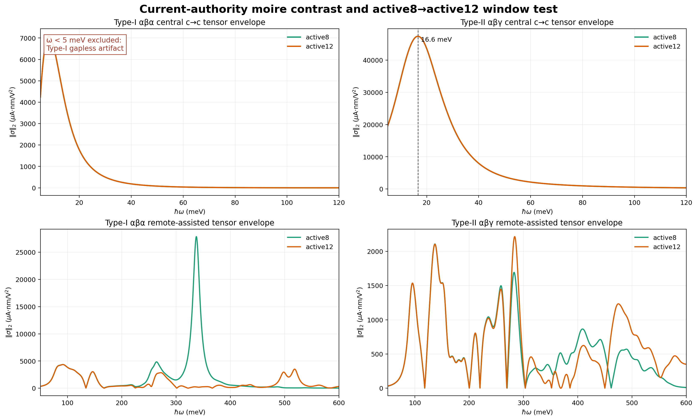

**Figure 1.** The upper panels compare the current-authority central `c_to_c` tensor envelopes of Type-I `alpha_beta_alpha` and Type-II `alpha_beta_gamma`. The erroneous Type-I interval below `5 meV`, including its spurious zero-frequency maximum, is not plotted. The remaining Type-I curve is still a gapless diagnostic, not an insulating-material coefficient. The Type-II peak occurs near 16.6 meV and reaches the current tensor-envelope norm `4.7397e4 microA nm/V^2`.

The active8 and active12 Type-II curves lie on top of one another, so its peak position and envelope scale survive active-window enlargement. By contrast, the large high-frequency Type-I remote-assisted active8 feature in the lower-left panel is not reproduced by active12 and is not part of the clean giant-BPVE claim.

This is the structural starting point of the story:

- **Type-II:** clean, gapped, finite-frequency, central-flat and active-window stable;
- **Type-I:** weaker central response, gapless neutral-H0 control, and quantitatively less reliable remote sector.

---

## 3. The `8e4-1e5` scale is a finite-frequency resonance, not a crossing anomaly

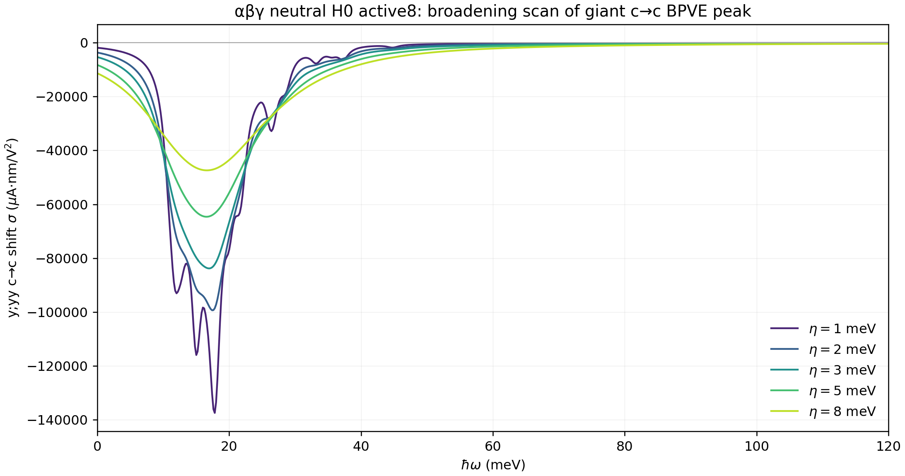

**Figure 2.** At historical normalization, the dominant Type-II component reaches about `9.9e4`, `8.4e4`, and `1.375e5` for `eta=2,3,1 meV`. These correspond to current-authority magnitudes of approximately `4.97e4`, `4.19e4`, and `6.876e4`. The last is the largest finite-frequency peak in the scan, near 17.8 meV, but all three are broadening diagnostics rather than the approved `eta=8 meV` headline coefficient. The narrowest curve develops fine spectral structure, as expected when resolved transition lines are broadened less.

The crucial observations are:

1. the peak remains at a finite frequency, approximately 16.6-17.8 meV;
2. the neutral Type-II source has a finite direct gap rather than a crossing at the chemical potential;
3. the integrated low-energy weight changes far less than the peak maximum when `eta` is varied;
4. the mechanism remains central `c_to_c`.

The Type-II source has direct and indirect gaps of `3.4795 meV` and `1.5630 meV`. In the P2 full-continuum source decomposition, the dominant contribution is a singleton-to-singleton central transition and is marked `candidate_near_degenerate_group=false`. This supports the statement that the 16.6-meV peak is neither a chemical-potential crossing nor a classified near-degenerate source. Arbitrary near-degenerate U(N) material-response treatment remains outside the approved scope.

Therefore the large scale cannot be dismissed as the Type-I zero-energy/gapless anomaly. The peak height is broadening-dependent, but the finite-frequency spectral feature and its large integrated weight are robust.

---

## 4. Reciprocal-space and active-space stability

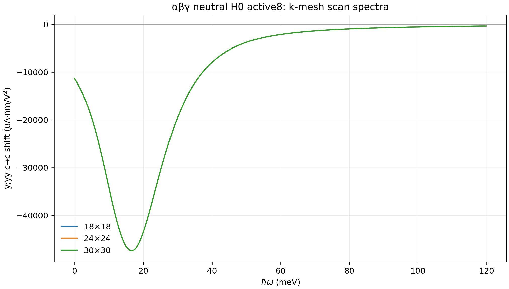

**Figure 3.** The `18x18`, `24x24`, and `30x30` Type-II spectra are visually indistinguishable at `eta=8 meV`. The peak frequency, line shape, and integrated weight are stable under this k-mesh refinement.

Together, Figures 1-3 provide three independent protections for the giant Type-II interpretation:

- finite direct gap and finite photon frequency;
- reciprocal-space mesh stability;
- active8-to-active12 window stability.

This combination is what distinguishes the giant BPVE from an accidental near-degenerate spike.

---

## 5. The giant response is a tensor, not a single positive number

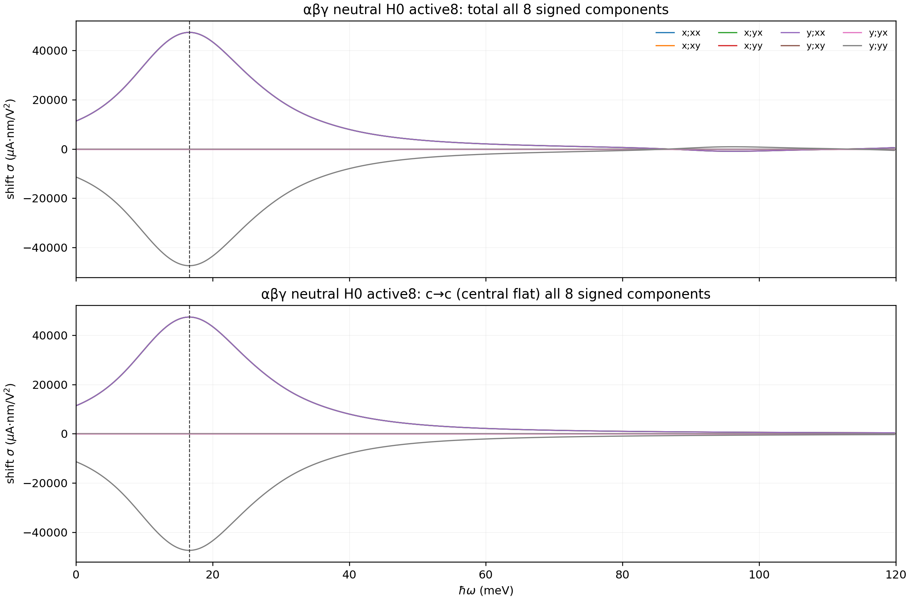

**Figure 4.** The Type-II response contains symmetry-related large positive and negative tensor components. The central `c_to_c` panel reproduces the low-energy total response, confirming that the giant peak is not generated by remote bands.

Two consequences follow:

- experiment must specify polarization and current direction rather than quote only a tensor norm;
- domain averaging can cancel a locally giant response even when every single domain is bright.

The all-component tensor envelope is useful for comparing structural classes and active windows, while a measured current requires the signed contraction with the laboratory polarization vector.

---

## 6. Mechanism: resonant central-flat transitions plus quantum geometry

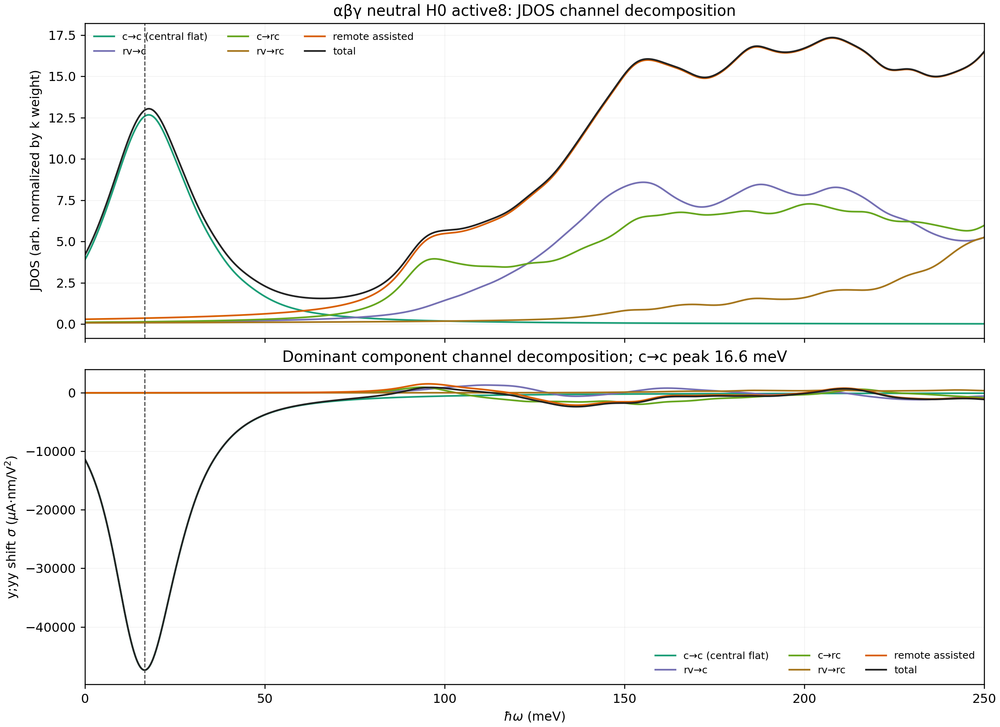

**Figure 5.** The low-energy JDOS peak is overwhelmingly central `c_to_c`. The dominant shift-current component is likewise reproduced by the central channel. This identifies the physical transition manifold, but JDOS alone does not explain the amplitude: a large BPVE also requires large optical matrix elements, a coherent signed shift/geometric factor, and weak cancellation among the important hot regions.

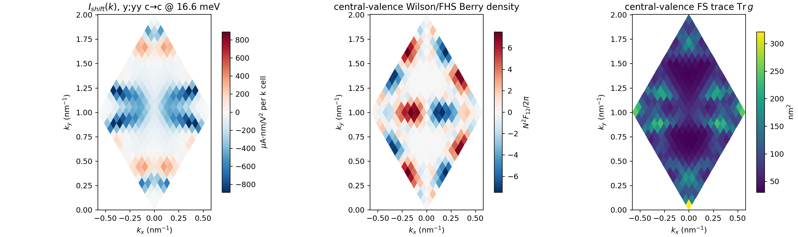

**Figure 6.** The shift-current integrand, local Berry-curvature density, and Fubini-Study trace all show structured hot regions in the mini-Brillouin zone. The Berry and FS maps are occupied-bundle diagnostics, not pair-resolved transition geometry; the FS trace is a finite-difference subspace-fidelity diagnostic. Their visual relationship supports only a shared-wavefunction-geometry interpretation.

This is not proof that Berry curvature or the metric alone causes the BPVE. A causal decomposition must compare, on the same transitions, the resonant phase space, optical weight, generalized derivative/shift factor, and signed cancellation.

---

## 7. Why Chern number is relevant but does not determine the amplitude

For an isolated occupied bundle,

\[
C=\frac{1}{2\pi}\int_{\rm BZ}\Omega(\mathbf k)\,d^2k
\]

is an unweighted Brillouin-zone integral of Berry curvature. Shift current is instead frequency-resolved, transition-selective, tensorial, and weighted by interband matrix elements and generalized derivatives. Hence no general relation of the form `sigma proportional to C` exists here.

The existing data already demonstrate this:

- the clean giant neutral Type-II benchmark has total central occupied `C=0`;
- finite local Berry-curvature texture survives even though its signed integral cancels;
- Type-II `C=+4` and `C=0` HF states are both bright but not equally bright;
- Type-I `C=-2` can be remote-assisted without becoming the brightest central-flat BPVE state.

These comparisons show that Chern number alone does not determine BPVE magnitude. They do not establish a universal necessary-or-sufficient criterion. A topological transition, or a change of occupied projector within a fixed Chern sector, can reorganize the transition-weighted local wavefunction geometry to which BPVE is sensitive.

---

## 8. Order parameters reshape the optical tensor

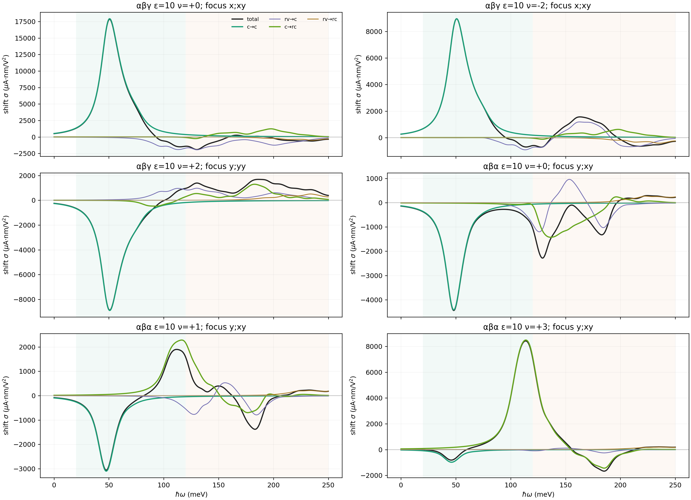

**Figure 7.** At fixed dielectric screening, Type-II HF states retain strong central `c_to_c` peaks, while Type-I positive-filling states are weaker or become remote-assisted. Filling and self-consistent order change peak frequency, sign, polarization component, and channel character.

The important comparison is not “ordered versus unordered” in the abstract. Different orders modify:

1. the interaction-renormalized gaps and transition frequencies;
2. spin/valley/flavor selection rules and occupations;
3. the local quantum geometry and optical matrix elements;
4. cancellation between symmetry-related hot regions.

BPVE is therefore a sensitive optical fingerprint of order, but a large response does not uniquely identify one order without a matched HF branch comparison.

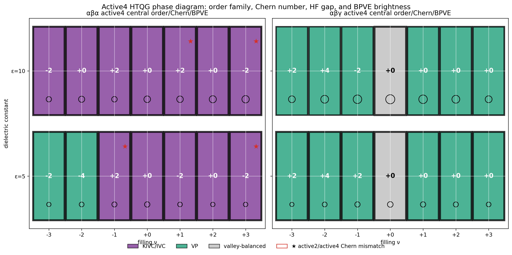

**Figure 8.** The active4 phase diagram places order family, Chern number, HF gap, and low-energy BPVE brightness in the same view. Type-II has active2/active4 Chern agreement in all shown rows; this is tested active-space consistency, not thermodynamic phase stability. Type-I contains the active-space-sensitive Chern mismatches and predominantly IVC/KIVC order.

The figure supports a structural/order correlation, not a one-to-one topological law. Several different Chern labels share similar order families, while brightness varies continuously rather than in quantized steps. For `epsilon=5`, active4 KIVC/TIVC decomposition was not computed; the `alpha_beta_alpha, nu=0` order amplitudes are inherited from an older table even though its convergence/source flag uses the final replacement.

---

## 9. A decisive separation: brightness changes strongly inside one topological phase

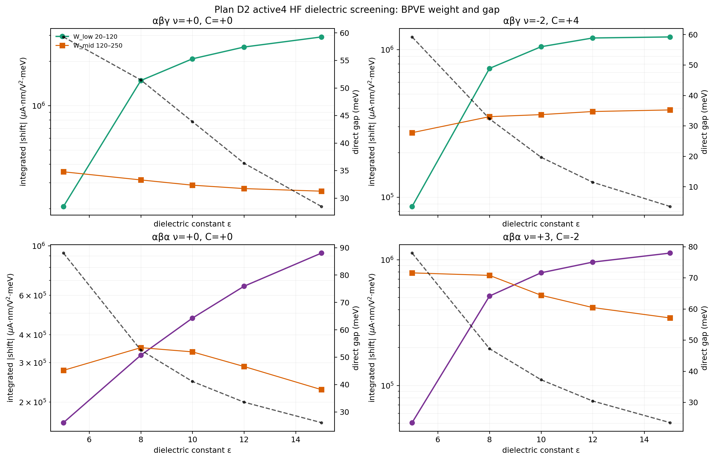

**Figure 9.** Along each sampled HF continuation branch, the Chern sector and reported order family remain fixed while the integrated low-energy BPVE changes strongly as dielectric screening changes and the gap softens. The `epsilon=8,12,15` states were seeded from the `epsilon=10` branch; possible branch crossings and global ground-state ordering were not tested.

This is evidence that the optical magnitude is not determined by the topological integer along these continuations. Screening changes band dispersions and the BPVE responds continuously. A corresponding change in wavefunction geometry is plausible but was not directly computed in this scan.

---

## 10. Domains are the experimental bottleneck and opportunity

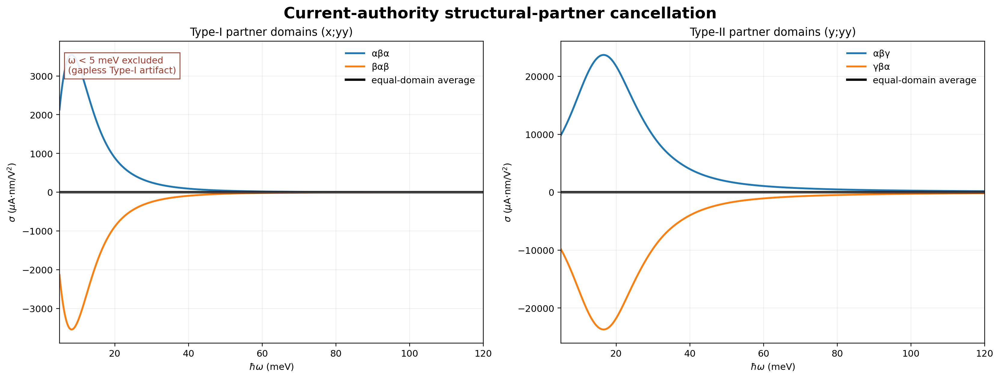

**Figure 10.** The two Type-II structural partners have nearly equal and opposite current-authority signed tensors. Their equal-area laboratory-frame average nearly vanishes, despite each domain having a giant local response. The erroneous Type-I interval below `5 meV` is omitted; the remaining Type-I curves are shown only as gapless partner-symmetry diagnostics.

This does not weaken the giant-BPVE result. It determines how it must be measured:

- use single-domain or strongly imbalanced samples;
- map local photocurrent with a spot smaller than the domain scale;
- register current direction to the crystal/device axes;
- measure polarization dependence rather than only total collected current;
- compare partner domains to test the predicted sign reversal.

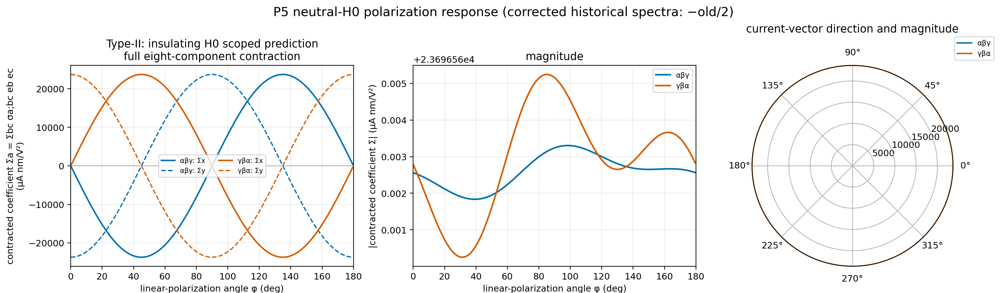

**Figure 11.** The corrected full-tensor contraction predicts a strong polarization-dependent current vector for the clean Type-II sector. The partner domain reverses the vector while retaining nearly the same magnitude. The former Type-I gapless diagnostic row has been removed from the report.

The natural experimental window is the terahertz/far-infrared regime: 16.6 meV corresponds to approximately 4 THz. HF ordering and screening can move strong features into the tens-of-meV range, so gate/filling and dielectric environment become tunable spectroscopy axes.

---

## 11. Largest response, enhancement strategies, and effective bulk units

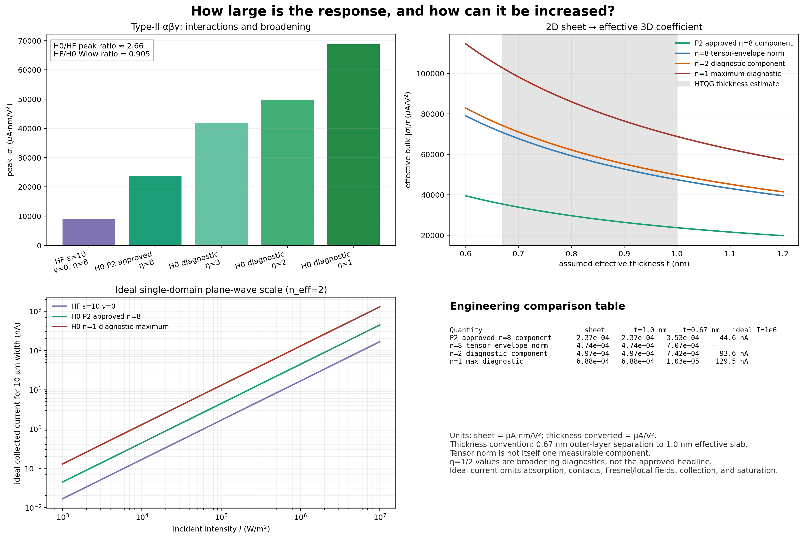

**Figure 12.** This figure separates the largest scanned peak from the recommended approved coefficient and converts the two-dimensional sheet coefficient to an effective three-dimensional engineering unit.

### Largest reported values

- **Largest peak in the finite-frequency broadening scan:** `6.876e4 microA nm/V^2` at approximately 17.8 meV for `eta=1 meV`. It corresponds, under the ideal assumptions below, to about `129.5 nA` across a `10 micrometre` width at `I=1e6 W/m^2` and `n_eff=2`. This is a broadening diagnostic, not the robust headline.
- **Recommended approved component:** `+2.3678e4 microA nm/V^2` at 16.6 meV and `eta=8 meV` from the P2 continuum approval. The corresponding ideal current is about `44.6 nA` for the same intensity, refractive index, and width.
- **Current `eta=8 meV` tensor-envelope norm:** `4.7397e4 microA nm/V^2`. This norm is useful for structural comparison but is not itself one directly measured tensor component.

### How to increase the response

1. **Use the Type-II `alpha_beta_gamma` structure near neutrality.** It supplies the clean central-flat `c_to_c` resonance; Type-I is much weaker after the invalid zero-frequency interval is removed.
2. **Reduce interaction-induced reshaping.** The neutral noninteracting H0 `eta=8 meV` component is about `2.66` times the active4 `epsilon=10`, `nu=0` HF peak (`2.3678e4` versus approximately `8.9e3 microA nm/V^2`). However, the HF/H0 integrated low-energy-weight ratio is still `0.905`; interactions mainly shift and redistribute the response rather than simply eliminating it. The dielectric continuation scan also shows increasing low-energy weight as screening weakens interactions, but it is not a multiseed global-ground-state scan.
3. **Reduce disorder/scattering when experimentally possible.** Smaller `eta` sharpens the peak, but the integrated weight changes much less; this raises peak height rather than creating new oscillator strength.
4. **Select polarization and structural domain.** Align the incident polarization with the dominant tensor contraction and use a single or strongly imbalanced Type-II domain. Equal partner-domain populations almost cancel the macroscopic current.
5. **Increase incident intensity or device width within the perturbative regime.** The ideal current scales linearly with intensity and width, but absorption, contacts, local fields, collection efficiency, relaxation, and saturation must be modeled for a device prediction.

### Thickness conversion for engineering comparison

For a sheet coefficient `sigma_2D` in `microA nm/V^2`, define the conventional effective bulk coefficient

\[
\sigma_{3D}^{\rm eff}=\frac{\sigma_{2D}}{t_{\rm eff}},
\]

where `t_eff` is expressed in nanometres. For helical trilayer graphene, the outer-layer center separation is approximately `2 x 0.335 = 0.67 nm`; allowing an effective optical slab thickness of `1.0 nm` gives a transparent comparison range:

| Quantity | Sheet coefficient (`microA nm/V^2`) | `t_eff=1.0 nm` (`microA/V^2`) | `t_eff=0.67 nm` (`microA/V^2`) |
|---|---:|---:|---:|
| P2-approved `eta=8` component | `2.3678e4` | `2.37e4` | `3.53e4` |
| `eta=8` tensor-envelope norm | `4.7397e4` | `4.74e4` | `7.07e4` |
| `eta=2` diagnostic component | `4.97e4` | `4.97e4` | `7.42e4` |
| `eta=1` maximum diagnostic component | `6.876e4` | `6.88e4` | `1.03e5` |

The effective 3D number depends inversely on the chosen atomically thin thickness convention. It is appropriate for coefficient-level comparison with bulk engineering materials, but it is not a unique microscopic bulk property of a two-dimensional sheet.

For the ideal plane-wave estimate used here,

\[
j_{2D}=\sigma_{2D}\,10^{-15}\frac{I}{c\epsilon_0 n_{\rm eff}},\qquad I_{\rm collected}=j_{2D}W.
\]

This conversion is an ideal single-domain full-collection scale, not a measured-device-current prediction.

---

## 12. Reframed core narrative

The result chain should be presented in this order:

1. **Structural selectivity:** Type-II `alpha_beta_gamma` supports a much larger clean finite-frequency BPVE than Type-I `alpha_beta_alpha`.
2. **Numerical legitimacy:** the giant Type-II peak survives broadening analysis, k-mesh refinement, and active-window enlargement, and is not a crossing/near-degeneracy anomaly.
3. **Microscopic mechanism:** central-flat `c_to_c` transitions combine large resonant weight with structured local quantum geometry.
4. **Topology:** Chern number labels global projector topology but does not set the BPVE magnitude; BPVE is sensitive to transition-weighted local wavefunction geometry.
5. **Order:** interaction-driven order can reshape gaps, selection rules, sign, and channel content, providing candidate discriminants between independently validated branches.
6. **Experiment:** the largest observable is local and domain-sensitive; polarization-resolved, domain-resolved THz photocurrent is the primary measurement.

The completed active6 Type-I P1-P5 work remains useful as a controlled remote-assisted and branch-robust comparison, not as the main evidence for the word “giant.”

---

## 13. Research program needed to close the topology/order story

### A. Structural origin of the giant contrast

Perform a matched Type-I/Type-II decomposition using identical mesh, broadening, active window, filling convention, and current prefactor. Separate:

- transition JDOS;
- optical matrix-element weight;
- covariant generalized-derivative/shift contribution;
- signed hotspot cancellation.

This is the shortest calculation that can say *why* Type-II is brighter rather than merely showing that it is brighter.

### B. Topology versus local geometry

Compare pairs of HF states that differ in Chern number while controlling the order family, and pairs that share the same Chern number while changing order. Track local Berry curvature, quantum metric, transition-resolved BPVE integrands, and integrated tensor components. A Chern-BPVE correlation must survive these controls before being called causal.

### C. Order-parameter spectroscopy

Use validated multiseed HF branches and follow SP, VP, IVC/KIVC/TIVC, and spin-coherent states without changing the Hamiltonian convention. For each branch, compare frequency, tensor sign, polarization phase, `c_to_c` versus `c_to_rc` content, and domain transformation.

### D. Experimental protocol

Prioritize domain-resolved, polarization-resolved THz photocurrent near the Type-II central transition. Sweep gate filling, dielectric environment, and temperature. The primary discriminants are peak frequency, sign, polarization phase, and domain reversal—not only the maximum current magnitude.

---

## Boundaries

- Signed amplitudes/integrands in historical Figures 2-9 require `-old/2`; norms/envelopes/absolute weights require `/2` without a sign. Figures 1 and 10-12 are already current-authority.
- The neutral Type-I H0 source is gapless; `hbar omega < 5 meV` is excluded from revised plots, and the remaining Type-I H0 curve is diagnostic only.
- The thickness-converted `microA/V^2` values depend on the chosen `0.67-1.0 nm` effective thickness convention.
- The clean Type-II result is a projected continuum-envelope, internal-interband, resonant shift-current result; microscopic orbital-position/external terms remain absent.
- Local Berry-curvature/metric similarity is not by itself a causal proof.
- Domain mixtures are structural-population models, not calculated thermodynamic populations.
- Ideal current conversion is not a measured-device prediction.

## Selected conceptual references

- J. E. Sipe and A. I. Shkrebtii, *Second-order optical response in semiconductors*, Phys. Rev. B 61, 5337 (2000).
- T. Morimoto and N. Nagaosa, *Topological nature of nonlinear optical effects in solids*, Sci. Adv. 2, e1501524 (2016).
- S. Chaudhary et al., *Shift-current response as a probe of quantum geometry and electron-electron interactions in twisted bilayer graphene*, Phys. Rev. Research 4, 013164 (2022), https://doi.org/10.1103/PhysRevResearch.4.013164.

## Figure provenance

Figures 2-9 are exact historical Plan-B products. Figures 1 and 10 are current-authority re-plots of saved Plan-B spectra with the invalid Type-I interval below `5 meV` explicitly excluded. Figure 11 is the corrected P5 Type-II panel, and Figure 12 is derived from validated report values and the stated thickness/current formulas. Only `alpha_beta_gamma` is directly P2 full-continuum approved; the `gamma_beta_alpha` partner tensor is projected-active8 and was not independently full-continuum audited.

Sources:

```text
results/HTQG_Fujimoto2025_hf/giant_bpve_mechanism_planB_20260709/
results/HTQG_Fujimoto2025_hf/noninteracting_active8_neutral_bpve_shift_all32_20260705/
results/HTQG_Fujimoto2025_hf/noninteracting_active12_neutral_bpve_shift_all48_20260705/
results/HTQG_Fujimoto2025_nextstage_20260712/P5_domain_experimental_observables/
```

The report package contains figures and narrative only; no raw numerical arrays, transition tables, checkpoints, or HF densities are included.
