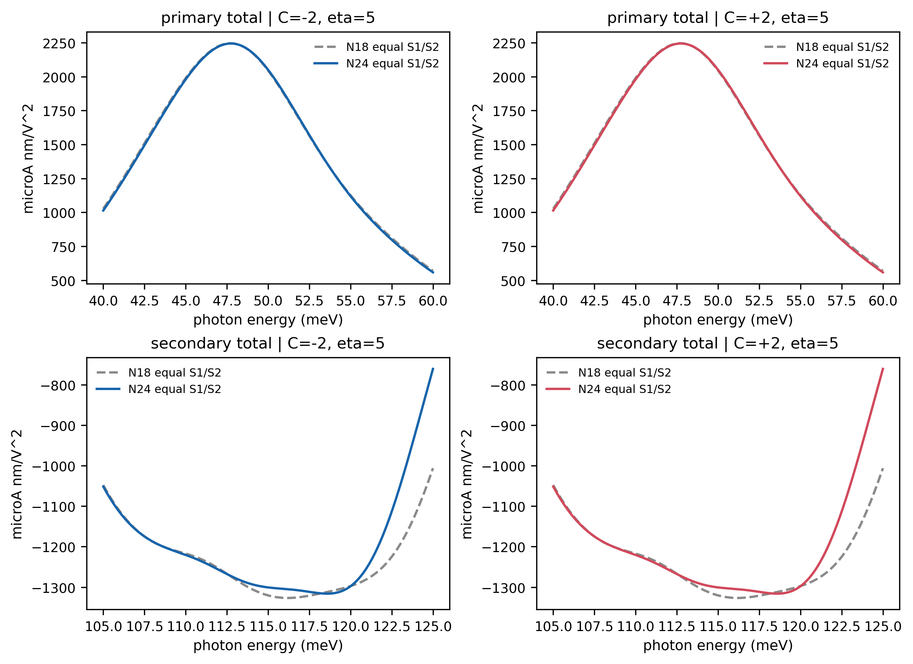
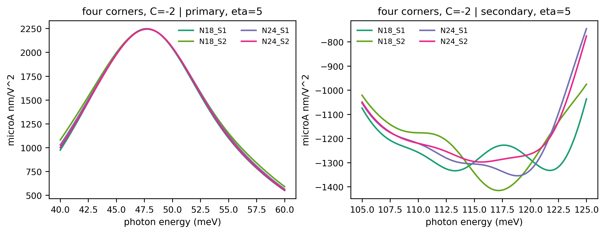
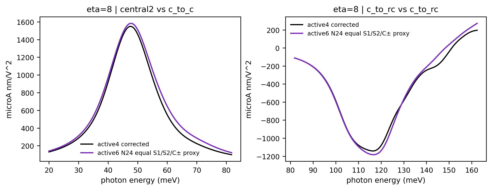
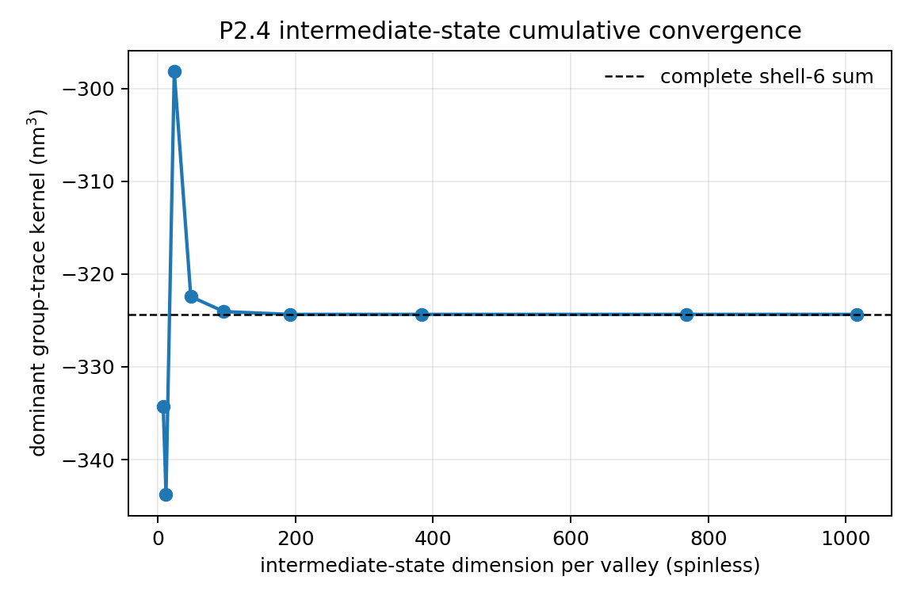
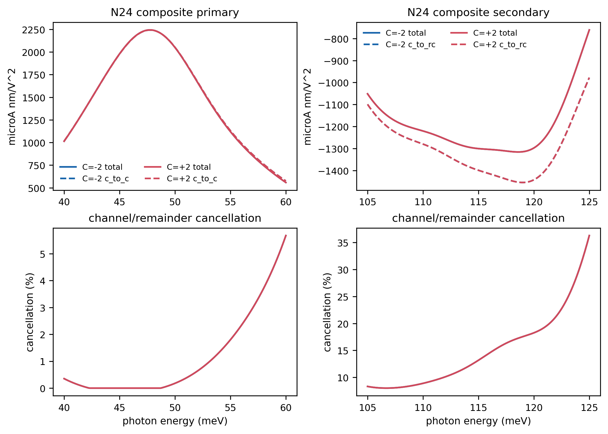
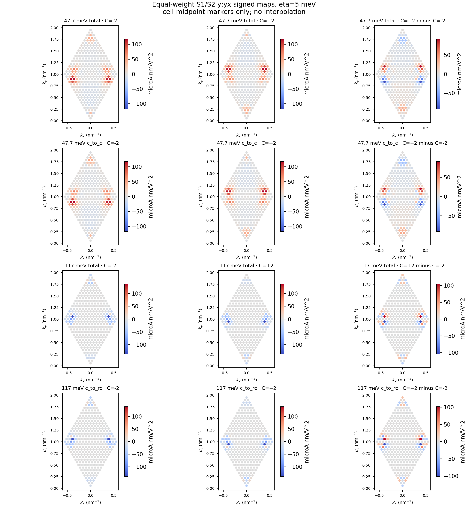
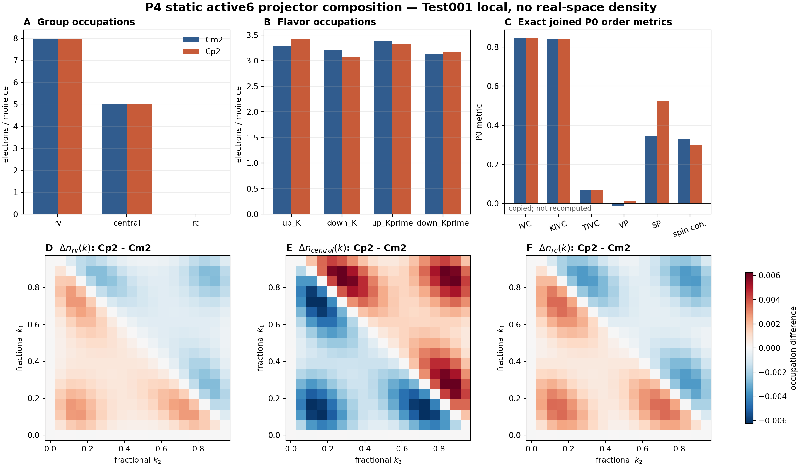
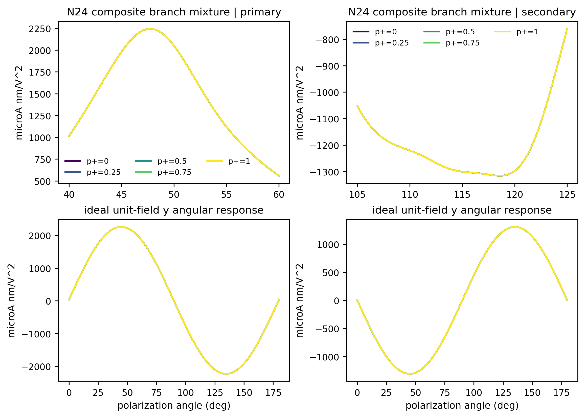
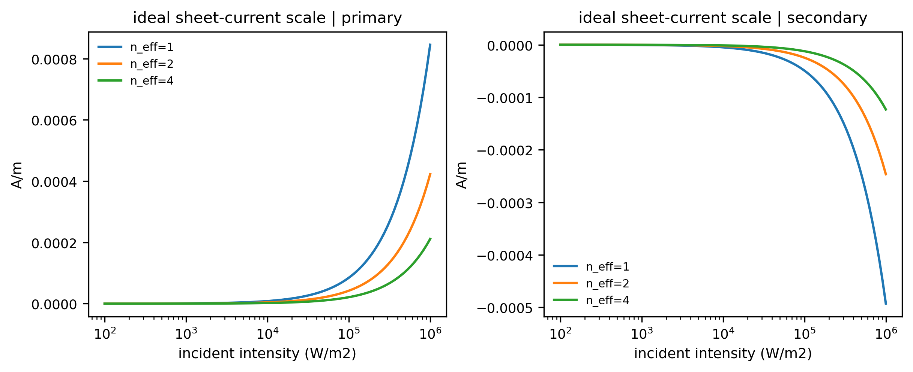

# HTQG active6 P1-P5 visual report

**System:** `alpha_beta_alpha`, `epsilon_r=10`, `nu=+1`

**Physical window:** active6 bands `505..510`, fixed saved HF density, exact target Gamma excluded

**Current optical authority:** equal-weight `S1/S2` target quadrature, compared at `N=18` and `N=24`

**Purpose:** explain the P1-P5 result chain through validated figures rather than raw numerical tables.

> **Main message.** The 47.7 meV central `c_to_c` peak is the robust headline result. The 115-119 meV `c_to_rc` structure survives active4-to-active6 and the full quadrature study, but it is more sensitive to reciprocal-space sampling. After symmetric S1/S2 composition, both features are essentially branch-independent between the strict `C=-2` and `C=+2` HF endpoints. The earlier S1-only branch-sensitive interpretation is superseded: the complete 2x2 evidence supports a quadrature-sensitive secondary whose equal-S1/S2 composites are nearly branch-independent.

---

## P1 - active6 optical response and target-quadrature control

### Figure 1. Equal-S1/S2 spectra at two target meshes



The upper row shows the central peak. The `N18` dashed and `N24` solid curves nearly coincide for both Chern endpoints, so its position, sign, and scale are stable under the completed target-mesh comparison. The lower row shows the remote-assisted feature. It remains clearly present and keeps its negative sign, but its detailed line shape moves more visibly when the target mesh changes.

The two Chern branches overlap within each panel. This is the first visual indication that the physical distinction between the branches does not become a sizeable difference in the integrated BPVE after the S1/S2 quadrature is symmetrized.

### Figure 2. Why the secondary is labelled quadrature-sensitive



The four curves are the complete `N18/N24 x S1/S2` target-quadrature corners. The primary curves form a compact bundle. The secondary curves show a visibly wider spread and shifted minima. Therefore the correct uncertainty assignment is:

- primary: stable across the completed target quadrature;
- secondary: physically persistent, but more sampling-sensitive;
- neither feature: assigned a formal convergence verdict, because no pass threshold was preregistered.

This comparison changes only the target integration. The source HF density remains the same saved unshifted `18x18` state in all four corners.

### Figure 3. Active4-to-active6 continuity



After correcting the historical active4 spectrum to the same named positive-transition prefactor, active4 and active6 have closely aligned peak positions and similar line shapes in both mechanism channels. The result supports continuity of the central `c_to_c` and remote-assisted `c_to_rc` structures when the physical active space is enlarged from active4 to active6.

The comparison is descriptive rather than a formal active-space convergence theorem because the reciprocal-cell placements differ and no post-hoc acceptance threshold is introduced.

---

## P2 - covariant-optics audit

### Figure 4. Intermediate-state closure



Small intermediate-state windows oscillate strongly and do not reproduce the complete shell-6 kernel. The cumulative result settles onto the full-shell reference only after enough intermediate states are retained. This figure is the visual reason the workflow rejects an arbitrary narrow virtual-state truncation as an absolute-response justification.

P2 validates the covariant generalized-derivative algebra, exact-degeneracy covariance, sign, and prefactor in its reviewed neutral-H0 continuum-envelope scope. It does **not** promote the active6 projected spectra to a full microscopic material coefficient; orbital-position/external terms and exact finite-width antiresonant tails remain outside the approved scope.

---

## P3 - mechanism of the two active6 structures

### Figure 5. Channel decomposition and cancellation



For the primary, the dashed `c_to_c` curve lies almost on top of the solid total curve. Its cancellation with all remaining channels is correspondingly small over the peak region. The primary is therefore a clean central-to-central transition feature.

For the secondary, the dashed `c_to_rc` contribution is larger in magnitude than the solid total response. Other channels partially cancel it, producing the shallower total spectrum. The secondary is therefore remote-assisted and carries a substantially larger signed-channel cancellation than the primary.

The blue and red curves overlap after equal-S1/S2 composition. The mechanism is different between the two energy windows, but the integrated mechanism is not a strong `C=-2` versus `C=+2` discriminator.

### Figure 6. Momentum-space origin



These are the **N18 equal-S1/S2** maps. The response is concentrated in discrete hot regions rather than spread uniformly over the mini-Brillouin zone. In the primary rows, the total map is visually reproduced by the `c_to_c` map. In the secondary rows, the total map follows the `c_to_rc` pattern.

The right column shows local `C=+2` minus `C=-2` differences. Local textures can differ appreciably even though the signed Brillouin-zone sums nearly coincide. This distinction is important: a locally different integrand does not automatically imply a different integrated conductivity.

No interpolation or smoothing is used. Corresponding S1/S2 reciprocal-cell values are averaged, and each average is displayed at the cell midpoint; the response is not recomputed at that midpoint.

---

## P4 - static active-space composition

### Figure 7. Occupation and order texture



The upper-left panel shows that the strict Chern branches have essentially the same average remote-valence, central, and remote-conduction occupations. The remote-conduction sector is almost empty in the static projector even though remote-conduction final states dominate the secondary optical channel. A large `c_to_rc` optical response therefore does not require a large static saved-projector remote-conduction occupation.

The flavor and P0 order panels show that the branches are not identical states: their spin/flavor texture differs. The lower maps reveal where these small occupation differences live in momentum space, with the central sector showing the clearest structured contrast.

This is a gauge-invariant active-space statement only. A coherent real-space, layer-resolved, or atomic density was not reconstructed because the saved P0 states do not contain the generation-bound active-to-full eigenvector phase receipt.

---

## P5 - polarization, branch mixtures, and ideal current scale

### Figure 8. Branch mixture and polarization control



The upper panels mix the strict HF endpoints incoherently from pure `C=-2` to pure `C=+2`. All mixture curves collapse onto each other after the equal-S1/S2 quadrature. Thus changing the branch fraction does not provide an efficient way to tune either spectral feature in the current calculation.

The lower panels show the full eight-component contraction for a rotating linear polarization. The primary and secondary have opposite angular signs: near the same diagonal polarization, changing photon energy from the primary to the secondary reverses the predicted conventional current direction. Within the projected resonant calculation, this frequency-controlled reversal is a model-level control proxy, not an established microscopic or device prediction.

The mixture fraction is only a branch proxy. The calculation does not establish thermodynamic domain populations or identify the two HF endpoints as structural domains.

### Figure 9. Ideal sheet-current scaling



The ideal sheet-current scale grows linearly with incident intensity and inversely with effective refractive index. The primary is positive in the chosen laboratory `+y` convention, while the secondary is negative, again showing the energy-controlled current reversal.

These curves are plane-wave, full-collection scales. They omit Fresnel transmission, local fields, absorption, finite spot/contact overlap, contact projection, collection efficiency, relaxation, saturation, and circuit geometry. They must not be read as measured-device-current predictions.

---

## Integrated P1-P5 picture

1. **P1:** two reproducible active6 structures survive the full target-quadrature study; the primary is much more stable than the secondary.
2. **P2:** the response algebra and prefactor are validated only within their declared scope; narrow intermediate-state truncations are not an absolute-response authority.
3. **P3:** the primary is a clean `c_to_c` process, while the secondary is `c_to_rc` with appreciable signed cancellation.
4. **P4:** both Chern branches have nearly identical average active-space composition but distinct spin/flavor and momentum-space textures.
5. **P5:** the composite optical response is nearly branch-independent; polarization and photon energy, rather than Chern-branch fraction, provide the clearest control knobs.

## Hard boundaries

- Exact target Gamma is excluded because the energy-ranked active6 boundary cuts a multiplet there.
- All active6 quadratures use the same fixed unshifted mesh-18 HF density; source-HF mesh convergence is not assessed.
- The active6 spectra are projected, resonant positive-frequency responses, not complete microscopic material coefficients.
- No target-quadrature or active-space convergence verdict is assigned without a preregistered threshold.
- P4 contains no active6 real-space density claim.
- P5 contains no equilibrium-domain or measured-device-current claim.

## Figure provenance

All figures are exact copies of validated result artifacts under:

```text
results/HTQG_Fujimoto2025_nextstage_20260712/
```

No raw `.npz`, `.json`, `.csv`, checkpoint, or source-density data is included in this report package.
