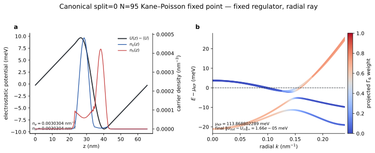
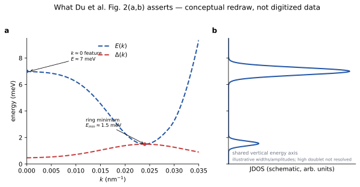
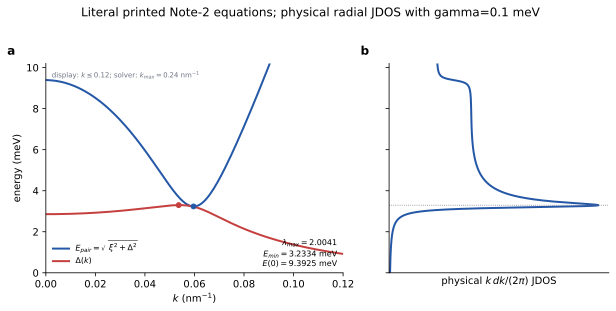
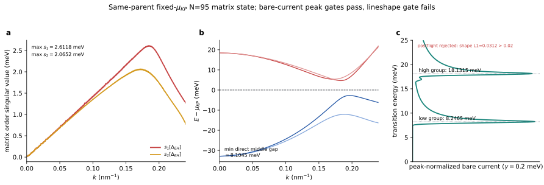

# Du2017 InAs/GaSb：N=95 Kane–Poisson、BCS/HF 与 Fig. 2 复现状态

> **状态日期：2026-08-20**
>
> **论文：** Du *et al.*, “Evidence for a topological excitonic insulator in InAs/GaSb bilayers,” *Nature Communications* **8**, 1971 (2017), DOI: [10.1038/s41467-017-01988-1](https://doi.org/10.1038/s41467-017-01988-1).
>
> **报告边界：** 本报告区分论文陈述、独立计算结果、诊断性降维和仍未闭合的问题。它不是“已经复现 Fig. 2”的声明。

## 1. 结论先行

目前最可靠的结论是：

1. 我们已经得到一个**来源绑定、在固定 `N=95/nk/kmax` regulator 上 fixed-point 收敛的 `split=0` 周期 Kane–Poisson checkpoint**。它给出
   \[
   \mu_{\rm KP}=113.8688022886634\ {\rm meV},\qquad
   n_e=n_h=3.030400009\times10^{11}\ {\rm cm^{-2}}.
   \]
   这个结果在自身的周期、canonical-neutrality ensemble 中是正确的；但其密度是论文名义值
   \(5.5\times10^{10}\,{\rm cm^{-2}}\) 的约 `5.51` 倍，因此不能称为论文 Wafer-B 固定栅压态的复现。
2. 论文 Fig. 2 的理论对象是**一个标量、无显式自旋指标的两带广义 BCS 模型**。图中的一条 \(E(k)\) 和一条 \(\Delta(k)\) 是该标量模型的原生输出，不是完整 \(4\times4\) Kane/HF 结果的平均。
3. 按 Supplementary Note 2 的印刷方程、主文给出的抛物两带参数和实验密度独立计算，得到
   \[
   \Delta_{\max}=3.29813\ {\rm meV},\quad
   E_{\min}=3.23336\ {\rm meV},\quad
   E(0)=9.39248\ {\rm meV},
   \]
   且使用物理二维测度 \(k\,dk/(2\pi)\)、保存的 Gaussian broadening \(\gamma=0.1\) meV 和预声明 peak criterion 时只有一个显著 JDOS 峰。它没有给出论文宣称的约 `1.5/7 meV` 双特征。
4. 在一个固定-\(\mu_{\rm KP}\) 标量控制中，我们没有使用单独的 `mu_scalar`，而是采用明确的 trace-center mapping：\(\mu_\Delta=2\mu_{\rm KP}\)、\(\mu_\Sigma=0\)，并移除 normal tunneling；非零解塌缩到约 \(6\times10^{-9}\) meV。这不是“无激子”的材料结论，而是说明**Kane chemical potential 与另一个标量 Hamiltonian 不能跨模型拼接**。
5. 保留同一 N95 Kane parent、正常 E1–H1 杂化和 \(\mu_{\rm KP}\) 的 exchange-only、径向 \(m=0\) 矩阵 HF/BCS 计算得到非零
   \(\Delta_{EH}(k)\in\mathbb C^{2\times2}\)，但其能标与 Fig. 2 明显不同。裸电流响应在 \(\gamma=0.2\) meV 时出现 `8.2465` 和 `18.1315 meV` 两组峰；它们是内部 stationary transitions，不是外边界假峰。峰位与 gauge gates 通过，但预声明 lineshape gate 失败，因此整体 postflight 是 **rejected**，不是 accepted optical spectrum。
6. 因而，**当前没有 source-closed、momentum-window-converged、conserving 的计算复现论文 Fig. 2。** 差异不是通过改坐标、漏掉径向 Jacobian、调 Coulomb scale 或挑 broadening 可以合法修复的。

---

## 2. 合同正确、固定 regulator 收敛的 N=95 Kane–Poisson checkpoint

图中所有曲线直接来自保存的 canonical N95 NPZ；右图只画保存径向节点上的精确 active-quartet 本征值。颜色表示投影 \(\Gamma_6\) 权重，避免把固定能量序号误写成跨整个动量范围不变的 E1/H1 身份。

### 2.1 计算合同

| 项目 | 值/约定 |
|---|---|
| Kane model | 8-band, `split=0` |
| z regulator | \(N=95\), \(L_z=65.5\) nm, \(\Lambda_z=9.113016857741385\,\mathrm{nm^{-1}}\) |
| radial grid | `nk=161`, \(k_{\max}=0.24\,\mathrm{nm^{-1}}\) |
| z grid | `nz=524`, cell-centered/interface-aligned periodic FV |
| temperature | `0.1 K` |
| electrostatics | variable dielectric, periodic zero-mean Poisson potential |
| chemical potential | canonical charge-neutrality root |
| active charge | occupied \(\Gamma_6\) electron components and unoccupied valence components as in Supplementary Note 6 |

### 2.2 保存结果

| 量 | 结果 |
|---|---:|
| \(\mu_{\rm KP}\) | `113.8688022886634 meV` |
| \(n_e=n_h\) | `0.00303040000918 nm^-2` = `3.030400009e11 cm^-2` |
| potential peak-to-peak | `19.0560971266 meV` |
| final fixed-point residual | `1.659375709e-5 meV` |
| minimum middle-rank direct gap | `3.5364671165 meV` at \(k=0.147\,\mathrm{nm^{-1}}\) |
| \(k=0\) active-quartet separation | `24.7758959978 meV` |
| source NPZ SHA-256 | `33f3116faf74080ab83ac342d70ecca59ee3b8e4eeb60c24a20911b1f6041c3a` |

这里的“正确”只表示：源参数、basis cutoff、Poisson closure、chemical-potential ensemble、保存数组和 replay 在固定 `N95/nk/kmax` 上彼此一致。它**不**表示 z regulator、momentum window 或 off-axis parent 已收敛，也不表示以下尚未给定的 Wafer-B 条件已经恢复：真实前栅/氧化层距离、work function、fixed charge、CNP gate voltage，以及四通道 electrostatic kernel。这个 checkpoint 的正式分类是 restored-TEIB radial-ray surrogate，而不是 fixed-gate material prediction。

还必须注意：固定 full-space ranks `(1144–1147)` 是本保存网格上的 active quartet 选择证据，不能写成一直到大 \(k\) 都保持不变的 E1/H1 band labels。

---

## 3. 论文 Fig. 2 到底表达什么

上图是根据论文正文和 caption 制作的**概念重画**，不是 PDF digitization，也没有被任何 solver 使用。

### 3.1 图的正确读法

- **Fig. 2a：** 横轴是 \(k\)，纵轴是能量；红虚线是标量 gap/order \(\Delta(k)\)，蓝虚线是 pair-breaking energy
  \[
  E(k)=\sqrt{\xi(k)^2+|\Delta(k)|^2}.
  \]
  在 Du 的 Supplementary Note 2（pp. 16–17）约定中，\(E^2=\xi^2+\Delta^2\)，mean-field matrix 的两个 signed eigenvalues 是 \((\eta\pm E)/2\)。相应 electron-like/hole-like 正激发代价是 \((E+\eta)/2\) 与 \((E-\eta)/2\)，拆出一对的总能量因此是 \(E\)。这就是 Fig. 2 caption 所称的 pair-breaking energy；不能再乘二。若采用通常把单个 quasiparticle energy 记成 \(E\) 的 BdG 记号，pair-breaking 会写成 \(2E\)，但那是另一套符号归一化，不能混用。
- **Fig. 2b：** 横向画 JDOS，纵向与 panel a 共用能量轴。论文正文宣称两个 singularity groups：
  - ring minimum 附近 \(E_{\min}\simeq1.5\) meV；
  - \(k\simeq0\) 附近 \(E\simeq7\) meV，高能组还带有两个近邻峰的细结构。
- **Fig. 2c：** 纵轴仍是能量、横轴是 transmittance；实验在 `1.4 K`, `B=0` 看到 transmission dips：Line A 约 `2 meV`，Line B 约 `7.3 meV`。
- **Fig. 2d：** 纵向错开画 `1.4, 5, 10, 20, 30, 40 K` 的 transmission spectra；两线在低温共存，约 `10 K` 时共同明显衰减/消失。
- **Fig. 2e–f：** 分别在 `1.4 K` 和 `20 K` 比较垂直磁场下的 spectra；论文强调两线在场中共同增强或重新出现。

论文把 Line A 解释为接近原 Fermi surface/ring minimum 的 pair breaking，把 Line B 解释为接近 \(k=0\) 的 pair breaking。两条线随温度共同消失、在垂直磁场下共同恢复，被作者用来支持它们来自同一个 EI condensate，而不是两个无关的单粒子 gap。

### 3.2 物理图像

论文讨论的是低密度、弱束缚的 BCS-like excitonic insulator：电子和空穴分别位于 InAs/GaSb，空间分离，但在动量空间原来的 electron/hole Fermi surfaces 附近形成相干配对。Coulomb attraction 使 normal semimetal 对 interband coherence 不稳定，并在原 Fermi surface 附近自发开 gap。

THz photon 把 condensate 中的一对弱束缚 e–h 拆成具有同一面内动量 \(k\) 的独立 electron 和 hole；不同 stationary points 的大量终态形成 JDOS 特征。作者据此区分 EI 与 dilute exciton gas/BEC：后者主要在 \(k=0\) 体现 binding energy，而不会在一个有限-\(k\) 原 Fermi surface 上出现 BCS-like spontaneous gap。

### 3.3 一个必须保留的概念边界

JDOS 是 phase space，光学 absorption 还需要 current/dipole vertex、coherence factor 和必要时的 conserving ladder/collective response。论文把实验 transmission 与 JDOS 直接联系，但 Supplementary Note 2 没有公开原始 JDOS loop、vertex、broadening、cutoff 或 raw arrays。因此：

> 论文的两个能量特征是明确的外部 benchmark；其未公开生成器不能被当成我们代码中已知的数值合同。

---

## 4. 论文的 BCS 是怎样做的

### 4.1 模型层次

论文主文使用一个 isotropic two-band electron–hole Hamiltonian。层内和层间 Coulomb interaction 写成
\[
V_{ee}(q)=V_{hh}(q)=\frac{e^2}{2\epsilon |q|},\qquad
V_{eh}(q)=V_{ee}(q)e^{-|q|d}.
\]
论文参数段给出 \(m_e\simeq0.032m_0\)、\(m_h\simeq0.136m_0\)、\(\epsilon\simeq15\)、full layer separation \(d\simeq10\) nm 和 \(n_0=p_0\simeq5.5\times10^{10}\,\mathrm{cm^{-2}}\)。论文/补充材料没有明确证明这些参数就是 Fig. 2 的完整数值输入。Lingjie Du 的 2016 Rice thesis（Sec. 3.1 附近及 Fig. 6.22 caption）把相关理论起点写成 isotropic、parabolic、indirect-gap two-band double-layer model，并注明 Fig. 6.22 data 由 Dr. Kai Chang 计算。

### 4.2 Mean-field 变量

Supplementary Note 2 没有显式 spin index，而是自洽求解一组标量函数：

- \(\Delta(k)\)：electron–hole coherence/order；
- \(\xi(k)\)：决定 pair spectrum 的对称/detuning channel；
- \(\eta(k)\)：particle–hole asymmetric channel；
- \(E(k)=\sqrt{\xi(k)^2+|\Delta(k)|^2}\)。

温度通过两个正 quasiparticle excitation costs 的 Fermi factors 进入。我们的 solver 明确定义
\[
f_-=f\!\left(\frac{E-\eta}{2}\right),\qquad
f_+=f\!\left(\frac{E+\eta}{2}\right),
\]
并对印刷方程采用以下 literal transcription：
\[
\Delta_k=K_{eh}\!\star\!\left[\frac{\Delta}{E}(1-f_--f_+)\right],
\]
\[
\xi_k=\epsilon_P(k)-\mu_\Sigma-K_{aa}\!\star\!\left[(1-\xi/E)(1-f_--f_+)\right],
\]
\[
\eta_k=\epsilon_M(k)-\mu_\Delta-K_{eh}\!\star\!\left[1-f_-+f_+\right],
\]
其中 \(\star\) 包含物理 radial weight 和 Coulomb kernel。我们的 Hamiltonian-level derivation把电子/空穴约束写成 chemical-potential sum/difference channels \(\mu_\Sigma\) 和 \(\mu_\Delta\)；这是对印刷方程和 \(n_e=n_h=n_0\) 约束的明确实现，不应冒充未公开的 Kai-Chang 原代码。Note 2 本身没有公开 Fig. 2 的 number-equation implementation、cutoff 或 JDOS loop。

### 4.3 数值上应该怎样做

一个不使用论文目标反推参数的实现需要：

1. 独立指定 bare electron/hole dispersions、density ensemble 和 \(d,\epsilon\)；
2. 用物理二维积分 \(\int k\,dk/(2\pi)\)，而不是 equal-\(k\) counting；
3. 对 unscreened \(1/q\) kernel 使用 annular-cell singular quadrature，而不是任意 `q_floor`；
4. 同时更新 \(\Delta,\xi,\eta\) 和对应 chemical-potential constraints；
5. 检查多个 seed 是否到达同一固定点；
6. 从同一个保存状态计算 \(E(k)\)，再单独计算 JDOS 或带 vertex 的 optical response；
7. 分别做 radial resolution 和 momentum-window convergence。

---

## 5. 我们的标量 Note-2 BCS 结果

这个计算没有使用 Kane–Poisson \(\mu\)、paper curve、digitized data、momentum rescaling、interaction rescaling 或 target-selected broadening。`nr=160→320` 和 \(k_{\max}=0.24→0.32025\,\mathrm{nm^{-1}}\) 检查均稳定。

### 5.1 主要结果 (`nr=320`, \(k_{\max}=0.24\,\mathrm{nm^{-1}}\))

| 量 | 结果 |
|---|---:|
| linearized \(\lambda_{\max}\) | `2.0040654141` |
| \(\Delta_{\max}\) | `3.2981328597 meV` at \(k=0.053625\,\mathrm{nm^{-1}}\) |
| \(E_{\min}\) | `3.2333602049 meV` at \(k=0.059625\,\mathrm{nm^{-1}}\) |
| \(E(0)\) | `9.3924846685 meV` |
| \(\mu_\Sigma\) | `-2.0061817454 meV` |
| \(\mu_\Delta\) | `-5.3447148985 meV` |
| two-seed \(\Delta\) difference | `3.31e-11 meV` |
| physical JDOS | one significant maximum near `3.295 meV` |

### 5.2 与论文不一样的地方

- ring minimum 在 \(k=0.059625\,\mathrm{nm^{-1}}\)，而论文 Fig. 2 的 minimum 约在 \(0.024\,\mathrm{nm^{-1}}\)；
- low feature 是 `3.23 meV`，不是约 `1.5–2 meV`；
- \(k=0\) 能量是 `9.39 meV`，不是约 `7–7.3 meV`；
- 物理 radial JDOS 只有一个显著峰，而论文报告两个 groups；
- 因此仅按公开参数和印刷方程并不能恢复 Fig. 2。

### 5.3 固定 \(\mu_{\rm KP}\) 的标量控制

把 canonical N95 \(\mu_{\rm KP}\) 固定，同时把 Kane quartet 压成 dehybridized E/H trace centers 后，控制计算采用
\[
\mu_\Delta=2\mu_{\rm KP}=227.7376045773\ {\rm meV},\qquad
\mu_\Sigma=0,
\]
且明确记录 `mu_scalar_used=false`，得到
\[
\lambda_{\rm bare}=0.30808,\qquad
\lambda_{\rm full}=0.168998,\qquad
\Delta_{\max}\approx5.9\times10^{-9}\ {\rm meV}.
\]
同一标量 reduction 的 bare densities 是
\(n_e=4.3952\times10^{11}\) 与
\(n_h=1.3451\times10^{11}\,\mathrm{cm^{-2}}\)，已经不等于 full Kane–Poisson 的共同密度。这个控制不是把一个标量 \(\mu\) 原样代入 Note 2；它是一个明示 sum/difference-channel mapping。结果说明 chemical potential 必须绑定其 exact Hamiltonian 和 ensemble，不能把 \(\mu_{\rm KP}\) 当成可移植的标量 BCS 参数。

---

## 6. 我们的 same-parent N95 矩阵 BCS/HF

### 6.1 定义

矩阵计算不再使用一个标量 \(\Delta(k)\)，而是保留 Kramers-resolved active basis
\[
\Psi_k=(E1_+,E1_-,H1_+,H1_-)^T,
\]
并求解
\[
H_{\rm MF}(k)=H_{\rm KP}^{(4)}(k)+\Sigma_F\!\left(D;k\right),\qquad
D=P-P_{\rm vac},\qquad
P_{\rm vac}=\operatorname{diag}(0,0,1,1).
\]

关键约定是：

- \(\mu=\mu_{\rm KP}\) 固定；
- Poisson potential 和 Kane parent 冻结；
- 正常 E1–H1 hybridization 保留；
- interaction density 是 \(P-P_{\rm vac}\)，不是 \(P-P_{\rm nonint}\)；
- fundamental order 是 \(\Delta_{EH}(k)=-(\Sigma_F)_{EH}(k)\in\mathbb C^{2\times2}\)；
- 精确 transition energies 来自完整 \(4\times4\) diagonalization。

### 6.2 `nr=640, nphi=512` 保存结果

| 量 | 结果 |
|---|---:|
| final SCF residual | `9.76009e-10` |
| max singular values \((s_1,s_2)\) | `(2.6118252691, 2.0652381569) meV` |
| minimum direct middle gap | `8.1045472380 meV` |
| indirect middle gap | `7.3946162525 meV` |
| \(\Delta\Omega\) relative to \(P_{\rm vac}\) | `-0.1014846084 meV nm^-2` |
| active-basis output densities | \(n_e^{active}=n_h^{active}\simeq0.00562367\,\mathrm{nm^{-2}}\) |
| microscopic projected densities | \(n_e^{micro}=0.00403914\), \(n_h^{micro}=0.00642744\,\mathrm{nm^{-2}}\) |
| microscopic charge imbalance | `-0.00238830 nm^-2` |
| result SHA-256 | `d112970f3853b9b03a714fd513c9c163132205c7056296db723eb733b0828580` |

`nr=320→640` 在不修改 gate 的条件下通过固定-\(k_{\max}\) radial spectrum 检查：spectrum drift `0.04618 meV < 0.05 meV`。但两套网格共享同一个 outer edge \(0.24075\,\mathrm{nm^{-1}}\)，所以这不是 momentum-window convergence。active-basis 的 \(n_e=n_h\) 也不等于 microscopic/electrostatic neutrality：固定 \(\mu\) 后 interacting density 发生变化而 Poisson 没有重闭合，因此该态不是完整 fixed-gate electrostatic equilibrium。它还是一个 seeded radial exchange-only stationary point，尚无 global-minimum certification。

### 6.3 裸电流双峰

使用 analytic parent-basis \(\partial H_0/\partial k_{x,y}\) 投影到保存的 microscopic frame，再旋转到 SCF eigenbasis，在 Gaussian broadening \(\gamma=0.2\) meV 下得到两组 dominant peaks：

- `8.2465 meV`：主要为 middle `2→3` transition；
- `18.1315 meV`：主要为 `1→4`，并有 `1→3` 权重。

`nr=320→640` 峰位漂移分别为 `0.027` 和 `0.033 meV`，通过预声明 `0.05 meV` gate；随机逐点 U(4) frame transformation 的响应误差为 `3.33e-15`。两组峰对应内部 stationary minima：

- `2→3`: `8.1044 meV`, \(k=0.18947\,\mathrm{nm^{-1}}\)；
- `1→4`: `17.9838 meV`, \(k=0.17964\,\mathrm{nm^{-1}}\)。

它们不是被拒绝的 `14.945 meV` outer-cell trace-JDOS artifact。但完整 normalized lineshape 的 radial L1 drift 是 `0.03120597 > 0.02`，所以预声明 `shape_gate` 失败，`accepted=false`，并写出了 `POSTFLIGHT_REJECTED.json`。因此**只允许说峰存在性/峰位和内部机制通过各自 gates；不允许说整个 optical postflight 或 lineshape 已通过**。

此外，axial covariance 给出
\[
U_\phi^\dagger (j_x\pm i j_y)_\phi U_\phi
=e^{\pm i\phi}(j_x\pm i j_y)_{\phi=0},
\]
所以 optical current 在 co-rotating frame 中属于 signed \(m=\pm1\) partner channels，而不是静态 SCF 的 \(m=0\) density channel。这是 response adapter 的解析约束，不是当前图中的数值结果。完整 optical TDHF/BSE 必须使用 \(m=\pm1\) harmonic Fock tensors；直接复用 \(m=0\) tensor 即使数值结构漂亮也是错误的。本报告提交时该后续计算仍在进行，不纳入当前物理结论。

---

## 7. 论文、标量计算和矩阵计算的直接比较

| 项目 | 论文 Fig. 2 | literal Note-2 scalar | fixed-\(\mu_{KP}\) scalar control | N95 matrix HF/BCS |
|---|---|---|---|---|
| one-body model | undocumented scalar two-band arrays | stated parabolic two-band | Kane trace-center reduction | full saved Kane4 parent |
| order | one scalar \(\Delta(k)\) | one scalar \(\Delta(k)\) | one scalar \(\Delta(k)\) | \(2\times2\) matrix \(\Delta_{EH}(k)\) |
| density/ensemble | \(n_e=n_h\sim5.5e10\,\mathrm{cm^{-2}}\); numerical closure unpublished | fixed each-layer density | \(\mu_{KP}\) fixed, scalar density not matched | \(\mu_{KP}\) fixed; density output, Poisson frozen |
| normal tunneling | absent from scalar Hamiltonian | absent | removed by reduction | retained |
| low pair scale | \(E_{min}\sim1.5\) meV; Line A \(\sim2\) meV | `3.2334 meV` | collapsed order | middle transition/bare-current `~8.1–8.25 meV` |
| high optical/JDOS scale | \(\sim7–7.3\) meV | \(E(0)=9.3925\) meV, no second significant JDOS peak | none | bare-current `18.1315 meV` |
| response type | paper JDOS + measured transmission | physical radial JDOS (\(\gamma=0.1\) meV) | scalar stability control | bare current (\(\gamma=0.2\) meV); overall lineshape postflight rejected |
| authority | external benchmark | independent scalar calculation | incompatibility diagnostic | fixed-parent matrix diagnostic |

---

## 8. 为什么目前结果与论文不同

差异首先来自物理合同，而不是画图方式：

1. **single-particle parent 不同。** 论文 Fig. 2 使用未公开的标量 indirect-gap arrays；我们的 canonical N95 Kane–Poisson quartet带有明显 normal hybridization 和不同 curvature/overlap。
2. **density/ensemble 不同。** canonical N95 自发 neutrality density 比论文名义密度高约 `5.51` 倍；固定 \(\mu_{KP}\) 的 interacting matrix state又改变 density，但没有重做 fixed-gate Poisson。
3. **order-parameter space 不同。** 论文是一条标量 \(\Delta(k)\)；Kane计算的基本对象是 Kramers-resolved \(2\times2\) coherence matrix，并同时产生很大的 diagonal carrier exchange。
4. **response observable 不同。** 论文比较 JDOS 与 THz transmission；我们目前只有 analytic-current bare bubble 的 peak-only gates 通过，而整体 lineshape postflight rejected。collective ladder 可能移动、重组或改变 brightness。
5. **原作者数值接口缺失。** 没有公开 Fig. 2 bare dispersions、cutoff、radial measure、singular-cell rule、broadening、JDOS loop、raw arrays 或 Note-6→Note-2 splice。
6. **UV/momentum window 未闭合。** radial mesh 已在固定 outer edge 收敛，但扩大 \(k_{\max}\) 的 same-parent matrix continuation 尚未完成。

以下做法已明确禁止作为“修复”：empirical Coulomb/channel scale、把 \(d\) 改成半层间距、momentum rescaling、equal-\(k\) counting、漏掉 \(k\) Jacobian、smoothing/clipping、按 paper peak 选 cutoff 或 broadening。

---

## 9. 当前可以和不可以声称什么

### 可以声称

- canonical `split=0`, `N=95` periodic Kane–Poisson checkpoint 在其明示 ensemble 内闭合；
- Supplementary Note 2 的公开模型是 native scalar BCS，不是 matrix-result average；
- literal public-input scalar calculation稳定地给出一个非零解，但没有论文双峰；
- same-parent N95 matrix calculation在固定 \(k_{\max}\) 下通过 `nr=320→640` radial gate；
- bare-current 两组峰的峰位、内部 stationary-transition 机制和 U(4) frame invariance 已通过当前 gate。

### 不可以声称

- 已复现 Du2017 Fig. 2；
- canonical periodic Kane–Poisson 就是实际 Wafer-B fixed-gate state；
- bare-current shape 是绝对 absorption 或 conserving conductivity；
- `8.2465/18.1315 meV` 是论文 `2/7.3 meV` 两条线；
- fixed-\(k_{\max}\) radial convergence 等于 UV/momentum-window convergence；
- 当前矩阵 stationary point 是 global ground state。

---

## 10. 证据与图像 provenance

本报告的 SVG 都是原创 replot/schematic；没有提交论文截图或 digitized paper curves。逐图 hashes 和源文件 hashes 在 [`figures/du2017/provenance.json`](figures/du2017/provenance.json)。主要计算证据为：

| 证据 | SHA-256 |
|---|---|
| canonical N95 Kane–Poisson NPZ | `33f3116faf74080ab83ac342d70ecca59ee3b8e4eeb60c24a20911b1f6041c3a` |
| literal Note-2 `nr=320` NPZ | `a412305105f9a19f589fee17135c36bf01cf51c0da1fa4e7280be19271620a5f` |
| nr640 Kane4 bundle | `7c0def02b2db9091677c01ed38f1e608620f12509046c6d033937a0929724f52` |
| nr640 matrix result | `d112970f3853b9b03a714fd513c9c163132205c7056296db723eb733b0828580` |
| nr640 bare-current NPZ | `cc2016f663a57ffae578673a3dd3e92988e4b458526dc75d78ef8b915b0654be` |
| canonical contract correction | `0d5c452c61335f95acb22b52374df098bfa33ddaacecaebff601669a84e999ed` |
| literal Note-2 report | `a3d3885e35cf7661bb7f34c1c43f5fe59fc87a19aee7f05166a663628a228d1f` |
| fixed-\(\mu_{KP}\) scalar-control report | `aae1c27cff946280acc733e7ae192640793e81002391b85e909c3bddeac35862` |
| bare-current postflight report | `9f80006fa0d4105d70d6f4b5483a88fba6d2e0ec6fe1d9d4596fd4d4c896d88f` |
| bare-current rejection marker | `c2573e89ff2dfd2d7cc27fa1c383d1b42123ee4d7ca72a15b8582b83d43a1e09` |

这些 hashes 标识内部计算 archive；大体积 NPZ/report bytes 不随本 public branch 分发。tracked generator、regeneration command、display transformations 和 source-distribution policy 都记录在 provenance JSON 中。

## 11. 文献定位

1. L. Du *et al.*, *Nature Communications* **8**, 1971 (2017), Fig. 2 caption；正文 “Theoretical model” 与 “Pair-breaking excitation measurement…” 段落；DOI: [10.1038/s41467-017-01988-1](https://doi.org/10.1038/s41467-017-01988-1)。
2. Du *et al.*, Supplementary Information, Supplementary Note 2, pp. 16–17（标量 \(\Delta,\xi,\eta,E\) 方程）；Supplementary Note 6, pp. 22–25（8-band Kane–Poisson）。
3. Lingjie Du, *Experiments on quantum phases in InAs/GaSb bilayers: Topological insulator and exciton condensation*, Rice University PhD thesis (2016), two-band model discussion and Fig. 6.22 caption。

## 12. 下一步

1. 完成 `nr=160` 的 signed \(m=\pm1\) finite-T TDHF/TDA pilot，并先检查 stationary/thermal closure、\(A_\pm/B_{\pm\mp}\) 结构、static Hessian、signed-sector pairing 和 current brightness。
2. 只有 pilot 通过，才生成昂贵的 `nr=320/640` \(m=\pm1\) tensors。
3. 扩大 same-parent momentum window，并要求候选峰不随 \(k_{\max}\) 移动。
4. 若要真正复现作者 Fig. 2，需要作者提供原始 two-band dispersions、chemical-potential/number convention、cutoff、radial measure、JDOS/vertex loop 和 raw arrays；否则只能把论文曲线当外部 benchmark，不能当 solver 输入。
