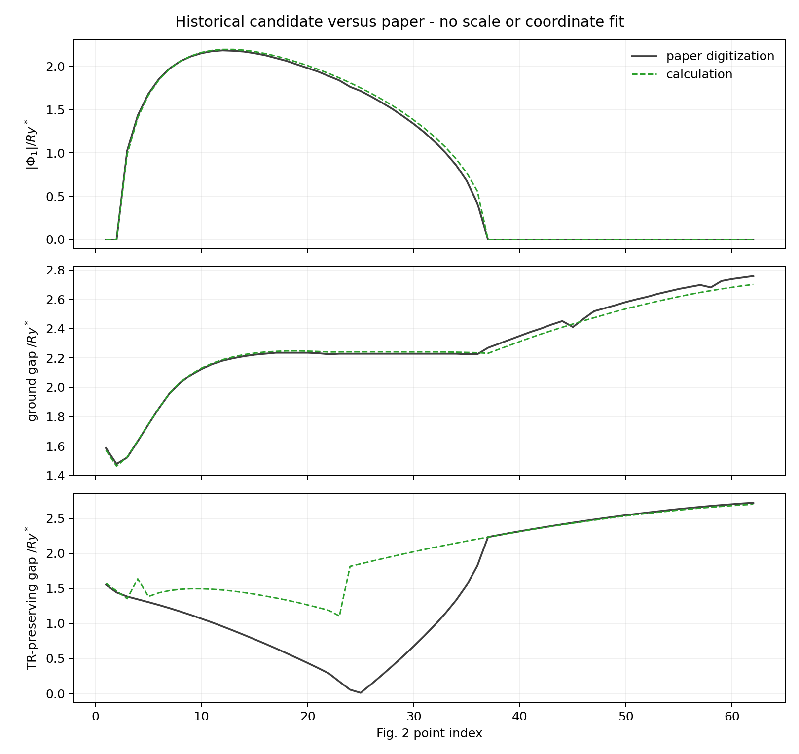
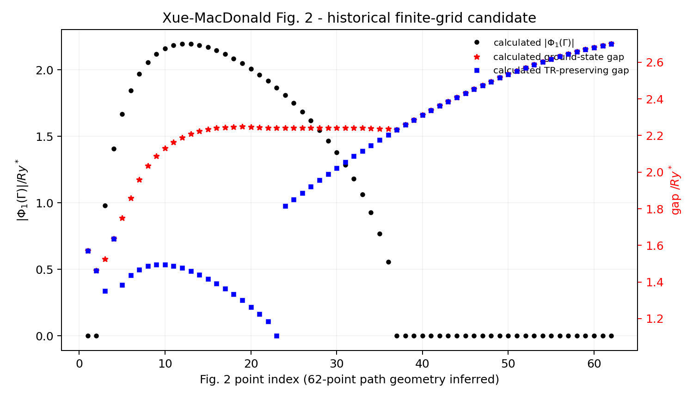
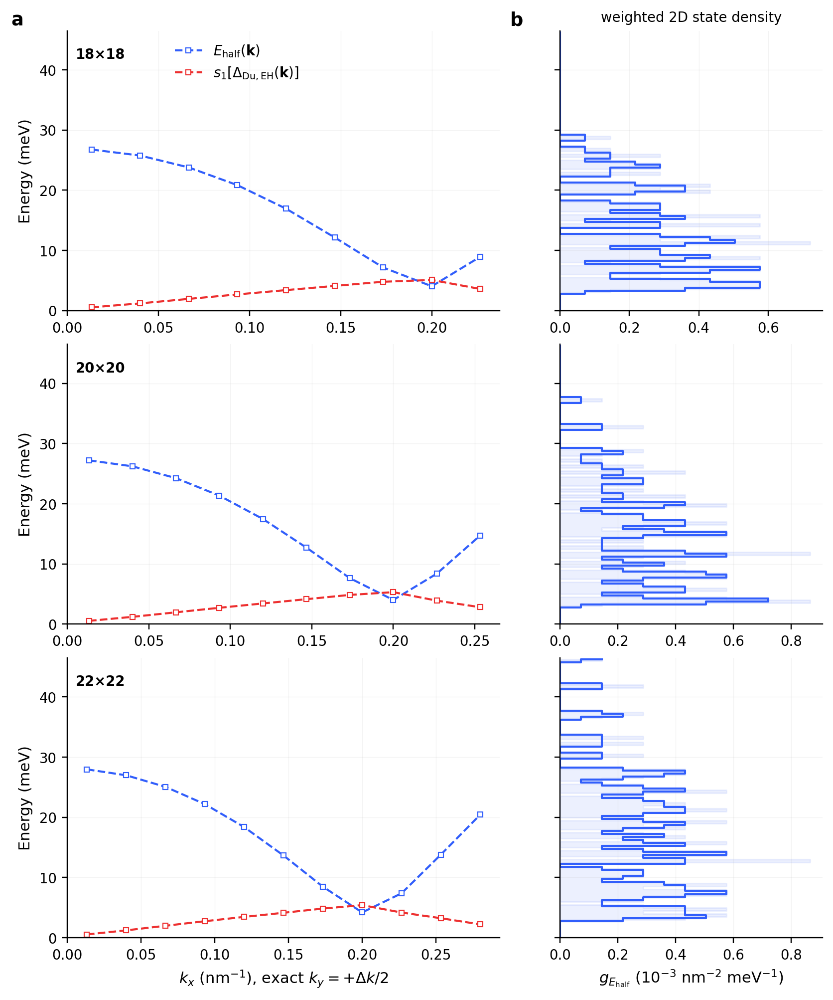

# Excitonic mean-field reproduction debug report

> **Branch:** `debug/excitonic-reproduction`
>
> **Status date:** 2026-08-28
>
> **Scope:** Du et al. (2017), Xue--MacDonald (2018), and Zeng--Xue--MacDonald (2022) InAs/GaSb excitonic mean-field lineage.

## 1. Executive status

This branch is the shared excitonic-debug branch. It replaces the older
Du-only UV-debug reports and deliberately separates:

1. source-attested equations and parameters;
2. historical finite-grid reconstruction;
3. regulator-converged continuum calculations;
4. constrained or forensic diagnostics;
5. unresolved source-lineage assumptions.

No result below uses target fitting, interaction multipliers, momentum-axis
rescaling, smoothing, clipping, or post-hoc coordinate repair.

| Target | Current status | Main blocker |
|---|---|---|
| Du et al. 2017 | fixed-regulator Kane--Poisson and matrix-HF diagnostics complete; not a material-scale reproduction | momentum-window/UV drift and missing split-reference Hartree/fixed-gate closure |
| Xue--MacDonald 2018 Fig. 2 black/red | strong historical reconstruction candidate | successful finite-grid convention is not source-attested; continuum self-cell lane is not yet regulator-converged |
| Xue--MacDonald 2018 Fig. 2 blue | not reproduced | paper curve does not follow the same unrestricted HF fixed-point branch found from Eqs. (5)--(8) |
| Zeng--Xue--MacDonald 2022 finite Q | equation/kernel implementation only | unpublished regulators, seeds, SCF settings, and the unresolved predecessor branch convention |

## 2. Xue--MacDonald 2018 Fig. 2 comparison



The solid dark curves are digitized paper markers. The dashed green curves are
our calculated values. The comparison uses the inferred 62-point path from the
paper source asset, with no scale or coordinate fit.

### 2.1 What agrees

The historical candidate uses a `61x61` inclusive square grid on
`[-3,3]^2`, uniform weights, and omission of the single `q=0` Fock point. This
is explicitly a historical diagnostic, not the preferred continuum regulator.
All interactions act on

\[
D=P-P_{\rm ref},\qquad P_{\rm ref}=\operatorname{diag}(0,1,0,1),
\]

with ordinary-electron occupations, neutral Hartree, and full matrix Fock.

For the selected normal/TRSB ground candidate, excluding unresolved competitor
points 9 and 37:

- `|Phi_1|` MAE: `0.01907 Ry*`;
- `|Phi_1|` maximum error: `0.14075 Ry*`;
- ground-gap MAE: `0.02376 Ry*`;
- ground-gap RMSE: `0.02993 Ry*`;
- ground-gap maximum error: `0.05731 Ry*`.

The Toeplitz FFT action is exactly the same saved-grid discretization as the
direct/dense kernel; trajectory parity is approximately `1e-14`.

### 2.2 What fails

The bottom panel is the higher-energy time-reversal-preserving nematic gap. Its
paper Hamiltonian is described schematically by

\[
H_{\rm TRS}(\mathbf k)=\xi_{\mathbf k}s_0\tau_z
+A k_xs_z\tau_x-A k_ys_0\tau_y+X s_y\tau_y.
\]

Our stable unrestricted TRS branch gives gaps

| Fig. 2 point | calculated gap / `Ry*` |
|---:|---:|
| 24 | `1.0162` |
| 25 | `0.9139` |
| 26 | `0.7809` |

and collapses at point 27. The paper instead approaches zero near points
24--25 and then reopens. Across the full path the blue-curve MAE is
`0.45300 Ry*`, with maximum error `1.84258 Ry*`.

### 2.3 Why this is not a plotting or weak-seed problem

We checked the full causal chain

```text
s_y tau_y seed -> D=P-P_ref -> Sigma_H[D]+Sigma_F[D]
-> full 4x4 H(k) -> rank-two projector -> exact-grid gap
```

and found:

- the seed satisfies `H_up,down^cv=-H_up,down^vc`;
- the saved p24 strong solution has time-reversal error `1.9e-13 Ry*`;
- projecting away additional allowed odd-k Pauli channels still gives p24 gap
  `0.9833 Ry*`;
- persistent-source, fixed-mixing, Hartree-omission, half-Hartree, and self-cell
  probes do not restore the paper closure;
- the literal four-term ansatz has an exact constrained unstable p24 root with
  residual RMS `2.9e-15` and gap `0.18836 Ry*`;
- when released into the complete 16-Pauli Eq. (5) space, that root converges to
  the normal fixed point with residual RMS `8.4e-16`, `X(Gamma)~0`, and gap
  `2.24159 Ry*`.

Therefore the blue curve is presently a source-lineage or unstated
constrained-solver ambiguity. The detailed audit is stored in
[`data/xue2018_blue_trs_branch_audit.md`](data/xue2018_blue_trs_branch_audit.md).

A calculation-only rendering is also retained:



## 3. Du et al. 2017 current status

The Du calculation and the Xue/Zeng effective-model calculation are separate
reproduction lanes; agreement in one cannot be used to tune the other.

### 3.1 Parent and matrix-HF checkpoint

For the corrected explicit `18x18` Kane--Poisson parent:

- `mu_SCF = 115.84324556255359 meV`;
- `n_e=n_h = 3.354689440138536e11 cm^-2`.

The same-parent ordinary-electron exchange-only matrix HF calculation gives:

- `max|Sigma_F| = 14.9944 meV`;
- `max|Phi_EH| = 2.53980 meV`;
- `max s_1(Delta_Du) = 5.07971 meV`;
- global gap `5.28645 meV`;
- rank-two direct gap `6.67467 meV`;
- reference-relative `Delta Omega = -0.1200316 meV nm^-2`.

These are fixed-regulator diagnostics, not a claim that the experimental EI
scale has been reproduced.

### 3.2 Momentum-window failure



Independent-parent `18 -> 20 -> 22` fixed-`dk` extension failed the momentum
window gate. From `20 -> 22`:

- gap drift: `-0.58741 meV`;
- `Delta Omega` drift: `-0.0103943 meV nm^-2`.

Blind extension of the same N70 domain is therefore not authorized. A full
Du promotion additionally requires split-reference Hartree

\[
H=H_0+\Sigma_H[P-P_{\rm parent}]+\Sigma_F[P-P_{\rm ref}],
\]

rather than applying `Sigma_H[P-P_ref]` to a parent that already contains its
own self-consistent Hartree potential.

The canonical N95 historical checkpoint remains

\[
\mu_{\rm KP}=113.8688022886634\ {\rm meV},\qquad
n_e=n_h=3.030400009\times10^{11}\ {\rm cm^{-2}},
\]

but it is not the unpublished experimental fixed-gate state.

## 4. Zeng--Xue--MacDonald 2022 status

The branch includes the source-equation implementation for:

- the Eq. (2) spin blocks and folded `(band,spin,n)` slab basis;
- the Eq. (6) valence-filled reference projector;
- Eq. (4) Coulomb components;
- neutral uniform Hartree;
- direct finite-Q Hartree/Fock actions;
- cell-integrated rectangular `q=0` Fock cells;
- exact-discrete dense and Toeplitz-FFT Q=0 kernels.

No finite-Q DW, QAH/DW, QSH/DW, topology, or phase-boundary result is claimed.
The intended next source-caption targets are the three Fig. 2 points at
`Q a_B*=1.8`, but they remain blocked from historical-authority status by
unpublished slab/window/mesh/self-cell/seed/SCF conventions.

## 5. What was implemented and checked

The branch contains:

- generic excitonic matrix-HF API and documentation;
- `src/mean_field/systems/inas_gasb/xue2018.py`;
- `src/mean_field/systems/inas_gasb/xue2018_hf.py`;
- `src/mean_field/systems/inas_gasb/zeng2022.py`;
- `src/mean_field/systems/inas_gasb/zeng2022_hf.py`;
- focused Xue/Zeng tests covering source signs, reference rank, Hermiticity,
  neutrality, Hartree normalization, singular self cells, finite-Q slab
  routing, ODA regression, and dense/direct/FFT parity.

The current focused Xue/Zeng result is `19 passed`. This validates the stated
software and small-array numerical contracts; it does not promote the
historical omitted-`q=0` lane to a continuum result.

## 6. Reproduction integrity and remaining work

We currently know the following:

1. Xue black/red historical agreement is strong and quantitative without
   plotting repair.
2. Xue blue failure is a core branch-definition/source-lineage problem, not a
   cosmetic discrepancy.
3. Du matrix HF is not momentum-window converged and lacks the required
   split-reference Hartree closure.
4. Zeng finite-Q production cannot inherit the Xue blue branch as an authority.
5. The physically preferred cell-integrated continuum lane must be converged
   separately from the historical omitted-`q=0` lane.

Required follow-up evidence is author code/raw arrays or an explicit statement
of the TR-preserving constrained solver, finite grids, `q=0` treatment,
cutoffs, initialization inventory, and topology seam conventions.

## 7. Tracked evidence and provenance

- Xue comparison image SHA-256:
  `b5842720b69d087410d577641d5f3518503d3829f39d663efba07b2ef89bbe57`
- Xue calculation-only image SHA-256:
  `7237a2d632ac5f4e8abd7c78480c338401afce3120c266d0d17d93e742f637a3`
- Xue postflight SHA-256:
  `6e87335e32cbdfdfba42a4bb0a9f99852412a95e98f343a10a8905f295fa4b06`

The tracked JSON files are bounded, pickle-free report inputs. Large NPZ
states, PDFs, raw Slurm outputs, and scratch root-solver campaigns remain
outside Git and are identified in the internal scientific archive.
