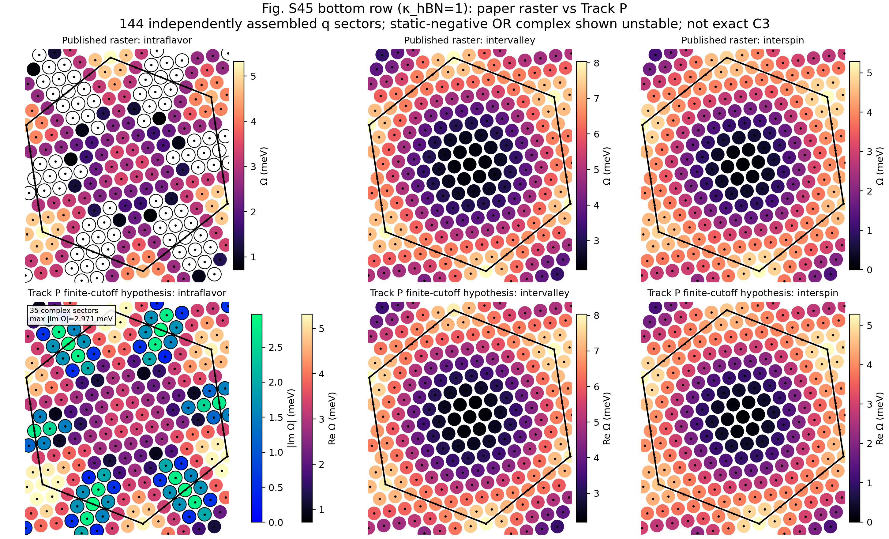
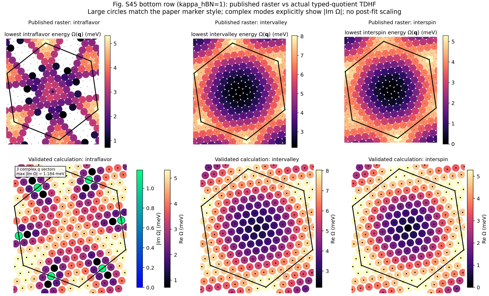

# RLG/hBN Fig. S45 debug report

**Date:** 2026-07-23
**Branch:** `debug/rlg-hbn-figs45-single-rep-20260723`
**Target:** Fig. S45 bottom row, `kappa_hBN=1`, `(0+4)` screened basis, `xi=1`, `theta=0.77 deg`, `V=64 meV`, `epsilon_r=5`, `12x12` mesh.

## 1. Executive conclusion

There are now two separately validated calculations, and they answer different questions.

1. The **typed C3-quotient calculation** is structurally complete on the full `12x12` q mesh. It satisfies source closure, q=0 response parity, signed q/-q identities, generic/self-sector C3, and raw non-Hermitian eigensolver checks. It is nevertheless a quantitative **nonreproduction** of Fig. S45: many calculated modes lie above the published raster, and only three intraflavor sectors are complex instead of the 45 white/unstable sectors digitized from the paper.
2. The new **matching fixed-G single-representative-active source** fixes the most important local-physics problem of the quotient. It passes SU(2) Goldstone/Ward, restores the nearly uniform Fig. S44 intervalley wavefunction, gives nonzero weight at the two nonzero C3-fixed torus points, and agrees closely with the paper at q=0 and the three smallest nonzero C3-related q points. However, its independently assembled generic-q matrices expose a source/Koopman C3 defect, so a new full mesh has deliberately not been run.

The current best physical interpretation is therefore:

- the upward shift of many quotient points is largely caused by the finite-regulator quotient changing the response Hilbert space and suppressing the attractive residual-exchange binding of the low intervalley/interspin modes;
- the matching single-representative functional repairs that binding and Ward consistency;
- the remaining blocker is not signed-q matrix construction but the full-source C3 prescription at finite cutoff.

This report does **not** claim a completed reproduction.

## 1.1 Update 2026-07-24: Goldstone stiffness and Track P full mesh

A key interpretation has been corrected. Both matching sources already pass the q=0 SU(2) Goldstone/Ward gate. The important Goldstone discrepancy is the **finite-q magnon stiffness**, not a nonzero q=0 gap. At the first shell, `|q|=0.0520429 nm^-1`:

```text
                              Omega(q)                 D=Omega/|q|^2
paper raster                  0.13092 meV              48.34 meV nm^2
fresh Track P                 0.13346--0.13620 meV     49.27--50.29 meV nm^2
typed quotient                0.78709 meV              290.61 meV nm^2
```

Thus the typed quotient stiffness is about `6.01` times the paper value, while the fresh fixed-G matching source is within approximately `4%` at the three independently assembled C3-related first-shell points.

The paper caption defines white sectors as **negative or complex** collective-mode energies. The 2026-07-24 runner therefore evaluates both the signed-q static Hessian

```text
H_stat(q) = [[A(q), B(q)], [B(-q)*, A(-q)*]]
```

and the raw Liouvillian spectra of independently assembled `L(q)` and `L(-q)`. Static-negative and complex classifications remain separate; their union is used only for comparison with the paper white mask.

The complete Track P `12x12` mesh has now been assembled independently for all three channels with no orbit copying or post-assembly averaging. The new comparison is:



Track P instability-mask result:

```text
paper intraflavor white sectors              45
Track P static-negative sectors              35
Track P complex sectors                      35
Track P real-negative-only sectors            0
true positives / false negatives             35 / 10
false positives among 99 paper-stable q       0
precision / recall / Jaccard             1.000 / 0.7778 / 0.7778
max |Im Omega|                            2.97076 meV
```

This is a major improvement over the typed quotient's `3/45` white-sector recall. It also establishes that all 35 recovered Track P sectors are both static-negative and dynamically complex; the API remains capable of reporting real-negative-only sectors, but none occur in the final Track P full matrices.

Stable-point comparison:

```text
channel        common-stable RMSE   mean(calc-paper)
intraflavor          0.55948 meV          +0.51472 meV
intervalley          0.13021 meV          +0.07635 meV
interspin            0.04992 meV          +0.00237 meV
```

The magnon branch is quantitatively close, intervalley is improved but just above the preregistered `0.10 meV` target, and intraflavor remains systematically too high. Track P is therefore the strongest paper-reproduction hypothesis so far, but not a completed reproduction.

Full-mesh C3 diagnostics also show why the calculation must not be renamed exact-C3:

```text
channel        max lowest-branch C3 spread
intraflavor             0.48342 meV
intervalley             0.16064 meV
interspin               0.12620 meV
```

The smallest-q C3 orbit is much better (`0.02897/0.01331/0.00275 meV`), but the full mesh exposes larger regulator-level defects away from Gamma.

Exact-M term ablation identifies the instability mechanism. Representative values over the three exact M-related sectors are:

```text
stage                         min eig(H_stat)        result
A0 only                       +18.92 to +19.63       stable
A0 + A_direct                 +19.02 to +19.72       stable
A0 + A_exchange              -1.04 to -0.89         real negative, no complex pair
A full, B=0                  +4.38 to +4.56          stable
A full + B_direct            +0.28 to +0.50          stable
A full + B_exchange          -2.79 to -2.58          complex, max |Im| 4.96--5.13
full                         -0.96 to -0.81          complex, max |Im| 2.75--2.97
```

`A_exchange` alone creates real static-negative directions, but `A_direct` restabilizes the full A block. The final exact-M complex quartet is driven by `B_exchange`; `B_direct` partially restabilizes it but does not remove the instability. This separates a negative static direction from the Krein/dynamical complex instability rather than treating every paper-white point as a complex eigenvalue by definition.

## 1.2 Generic finite-q shared-HF response and finite-difference gate

Track P now has a link-resolved stored-density response API in which density axis 0/1 momentum fibers, raw signed q, torus q, physical G shell, and output fibers are explicit. The response returns Hartree and Fock components separately. A projected action performs the same contraction without materializing every `nt x nt` output block.

Actual-12x12 validation against the independently maintained D12/D19 term builder passed:

```text
S1 sampled q=(1,0),(5,5),(-6,0), both signed sectors
max component/column residual               6.00e-16 meV

S2 every one of 432 columns, both signed sectors
q=(1,0):  A_direct/A_exchange/B_direct/B_exchange
max residual                               5.80e-16 meV
q=(-6,0), with raw partner q=(+6,0)
max residual                               5.55e-16 meV
```

This checks wrapped source columns, fixed-node columns, generic q, wrap-heavy q, and exact M without reconstructing `-q` from the negative branch of `L(q)`.

A separate scalar-energy finite-difference gate was then performed at generic `q=(1,0)`. The density follows an exact unitary-projector path; the scalar energy includes the q=0 diagonal change and independently contracted q/-q off-diagonal sectors. Four preregistered five-point ladders were compared with `2 v^dagger H_stat v / Nk`:

```text
direction       target (meV/cell)   finest FD residual
X only             1.22152795            +2.07e-8
Y only             1.41176327            +2.76e-8
X+Y                2.63329122            -1.08e-8
X+iY               2.63329122            -1.08e-8
max |Im E|                               1.4e-17 meV/cell
```

Thus the generic-q Track P response is now both termwise and scalar-curvature validated. It has **not** yet been promoted as a complete all-q shared production truth because the exact-M physical curvature gate remains unresolved: on the even mesh, raw `q=(-6,0)` and `-q=(+6,0)` have identical torus endpoints but distinct repeated-zone wraps. A physical density tensor cannot distinguish those raw labels without an explicit sewing/representative prescription. Averaging the two responses would be a forbidden post-assembly repair. Until that branch prescription is derived or supplied by the authors, the exact-M static negative eigenvector is a validated signed-regulator result, not yet a uniquely lifted unitary-projector curvature.

Auditable aggregate data committed with the report:

```text
reports/data/rlg_hbn_figs45_track_p_intraflavor_fullmesh_144q_20260724.json
reports/data/rlg_hbn_figs45_track_p_flavorflip_fullmesh_144q_20260724.json
reports/data/rlg_hbn_figs45_track_p_m_term_ablation_20260724.json
reports/data/rlg_hbn_track_p_finite_q_response_and_fd_validation_20260724.json
```

## 2. Earlier typed-quotient comparison figure



Figure conventions:

- top row: digitization of the JPEG raster embedded in the paper PDF;
- bottom row: actual typed-quotient TDHF calculation;
- ordinary marker color: real part of the lowest physical mode energy;
- green-ring marker/colorbar: `|Im Omega|` in dynamically unstable sectors;
- no post-fit scale, offset, mask repair, orbit averaging, or paper-spectrum filtering is applied.

The paper digitization is raster evidence, not author-supplied raw numerical data.

## 3. Full-mesh typed-quotient result

The completed typed-quotient production mesh has:

```text
channel        stable sectors   complex sectors
intraflavor          141               3
intervalley          144               0
interspin            144               0

complex intraflavor sectors: (-6,-6), (-6,0), (0,-6)
max |Im Omega|: 1.1838479262405022 meV
```

Its structural diagnostics are strong:

```text
max A/B/L structure residual       7.02e-16 meV
max q/-q PH/quartet residual       4.77e-12 meV
```

But comparison with the published raster fails quantitatively:

```text
channel        common-stable RMSE
intraflavor          1.69112 meV
intervalley          0.73014 meV
interspin            0.77488 meV
```

The paper raster contains 45 intraflavor unstable sectors. The quotient result contains only the three exact M-related complex sectors. This is why the bottom row of the figure must be labelled `validated calculation`, not `reproduction`.

## 4. Why many quotient points are too high

### 4.1 The difference is not an A0/Koopman sign error

At q=0 the intervalley mode results from a cancellation between a roughly `55 meV` Koopman particle-hole cost and a roughly `-50 meV` interaction binding contribution. Comparing the typed quotient response with the conventional single-representative response on the same old source showed that the main difference lies in the residual-exchange Hessian.

For 26 C3/inversion representatives:

```text
typed quotient paper RMSE             0.70207 meV
single-representative diagnostic RMSE 0.07769 meV
mean diagnostic-minus-quotient       -0.64863 meV
```

This diagnostic could not initially be promoted because it did not use a matching stationary HF source. It nevertheless localized the upward shift to the response kernel rather than to plotting or energy-zero alignment.

### 4.2 The quotient imposes physical fixed-node suppression

The lowest q=0 intervalley mode provides a direct discriminator:

```text
                                  fixed-point weight   IPR*Nk
typed quotient                    2.80e-29             1.0211
single-representative diagnostic  0.0116289            1.0061
paper statement                   nearly uniform       approximately 1
```

The exact quotient forces nodes at the two nonzero C3-fixed torus points. At finite 19-RLV regulator this is not a passive gauge relabelling; it changes the response subspace and can reorder the lowest modes.

The effect is mode reordering rather than a uniform perturbative shift of one vector. At q=0:

```text
lowest-eigenvalue difference                      -0.53684 meV
Rayleigh shift of matrix difference on typed mode +0.000605 meV
```

Therefore no post-hoc global energy correction is legitimate.

## 5. Fresh matching single-representative source

The current candidate is explicitly

```text
fixed_g_torus_single_representative_v1 active interaction
+ fixed_abs_g_shell_v1 physical 13-G shell
+ actual_node_ws_c3_fixed_copy_average_v1 frozen-remote h0
```

It is not described as a wholly single-representative model because the frozen-remote one-body contribution is C3 repaired.

### 5.1 Immutable source and saved-H closure

Job `192734` converged in 94 iterations. Slurm labelled the wrapper `FAILED` only because an obsolete post-save gap-report call used the old function signature. The archive itself had already been safely written. Follow-up job `193021` independently reloaded and validated it:

```text
final SCF residual              9.8384239887e-8
energy                         -547.0919427055 meV
gap                             14.5200275809 meV
saved-H closure                 2.5121479339e-15 meV
h0 basis reload residual        0
projector commutator            5.7193570457e-6 meV
projector idempotency           1.3322676296e-15
```

The immutable 135-entry source/input manifest hash is

```text
3699594b60a3ea7d01c53b3d2c6d5c62e43be7c3cccfd883822be95da1743b92
```

The frozen-remote array content hash is

```text
bd0cb9e54f80899ea4e7b74bc3e1e65a782aa9bb0b79f85d60107d859b022dfd
```

Known debug-branch limitation: the source closure fixes the exact remote array by SHA256 and the launch manifest fixes the generating code/cache, but the generic projected-basis cache schema does not yet persist the remote-H0 algorithm policy as an independently validated cache-key field. Therefore the archived policy string plus hash is sufficient for this immutable run, but a future cache migration should type the generating remote-H0 policy directly rather than infer it from the active code path.

### 5.2 q=0 Ward and Fig. S44 wavefunction gate

Job `193030` passed:

```text
interspin Goldstone energy       7.8895137485e-10 meV
spin-generator Ward residual     4.5924572586e-6 meV
source stationarity tolerance    1.0e-5 meV
spin-generator mode overlap      0.9999999999999828
raw max |Im Omega|               5.98e-14 meV

intervalley energy               2.1669489781 meV
paper-raster q=0 energy          2.2261371606 meV
fixed-point probability          0.0116299120
IPR*Nk                           1.0059993536
Y norm squared                   0
raw max |Im Omega|               8.41e-14 meV
```

Thus the matching source simultaneously restores Ward consistency and the nearly uniform/nonzero-fixed-point mode expected from Fig. S44.

## 6. Smallest finite-q checkpoints

Jobs `193042/193043` independently assembled signed matrices at

```text
(1,0) -> (0,1) -> (-1,-1)
```

for intraflavor, intervalley, and interspin channels. No matrix or spectrum was copied around the C3 orbit.

### 6.1 Comparison with paper raster

```text
channel       calculated three-anchor range   paper raster   three-anchor RMSE
intraflavor   3.45160--3.48057 meV             3.40652 meV    0.05715 meV
intervalley   2.27344--2.28675 meV             2.32975 meV    0.04905 meV
interspin     0.13346--0.13620 meV             0.13092 meV    0.00374 meV
```

These checkpoints strongly support the conclusion that the quotient was responsible for much of the systematic upward shift.

### 6.2 Signed-q and solver diagnostics

```text
max assembled structure residual       8.01e-16 meV
max q/-q PH assignment residual        4.72e-12 meV
max raw solver residual                4.25e-12
raw complex modes                      0 at all nine anchor blocks
```

The finite-q matrix-pair implementation is therefore not the source of the remaining discrepancy.

## 7. Current C3 blocker

Although the low branches are close to both one another and the paper, the full spectrum does not yet pass the preregistered production C3 gate:

```text
channel       lowest-branch spread   full A C3 residual   full L C3 residual
intraflavor       0.02897 meV             1.71232 meV          1.56314 meV
intervalley       0.01331 meV             1.36547 meV          1.84835 meV
interspin         0.00275 meV             1.45772 meV          1.61670 meV
```

Job `193053` decomposed the failure:

```text
fresh source canonical-band C3 max/mean   1.19671 / 0.51666 meV
Koopman spectrum C3 residual               1.60379--1.97960 meV
interaction-only A C3 residual             0.04279--0.09371 meV
```

An independent read-only audit verified:

- the reciprocal map is `C3(m,n)=(-n,m-n)`;
- `(1,0)`, `(0,1)`, and `(-1,-1)` form the correct orbit;
- global particle/hole index decoding is correct;
- rotated pair-key sets match;
- eigenvalue assignment is invariant to pair ordering.

Therefore the current full-spectrum C3 defect is real and is dominated by the fresh HF source/Koopman term. The low-energy C3 spread is already small, but it must not be confused with a passed full-source C3 gate.

## 8. What is still missing for a true reproduction

A new full `12x12` mesh is intentionally blocked until one of the following is available:

1. the authors' finite-cutoff periodic-gauge, fixed-point, remote-valence Fock, and symmetry-replication prescription;
2. a complete derivation of a full-torus pairing-unitary C3 action and matching scalar functional which preserves the full tangent space without reintroducing quotient fixed nodes.

The paper states that TDHF uses the final HF Hamiltonian and four-fermion matrix elements, but does not specify whether HF k points or TDHF q sectors were independently assembled or copied from an irreducible wedge. This information is now the main reproduction blocker.

A formal full-Hilbert Reynolds average may be mathematically possible,

```text
K_sym[D] = (1/3) sum_r (R^sharp)^r K_raw[R^r D],
```

but it has not been implemented or treated as paper-derived. Before any expensive rerun it would require independent proofs of full-torus sewing unitarity, `R^3=I`, pairing adjointness, scalar-energy differentiation, and fixed-point tangent preservation.

## 9. Integrity boundary

The following remain forbidden as reproduction fixes:

- assembled A/B/L averaging or Hermitization;
- C3 orbit copying presented as independently calculated data;
- fixed-leg deletion or fixed-node mask repair;
- empirical scale/offset fitting;
- selecting only paper-like modes;
- hiding complex modes as missing values;
- smoothing or changing the instability mask in plotting.

Complex sectors must continue to be shown with their raw `|Im Omega|`.

## 10. Auditable artifacts

Core reports:

```text
reports/rlg_hbn_figs45_typed_quotient_full_mesh_20260720.md
reports/rlg_hbn_figs45_response_kernel_physics_discriminator_20260722.md
docs/debug/FIXED_QUOTIENT_DERIVATION.md
```

Figure committed with this debug report:

```text
reports/figures/rlg_hbn_figs45_kappa1_validated_vs_paper_raster_paper_markers_imag_20260722.png
```

Important local result roots (large raw arrays are intentionally not committed):

```text
results/RnG_hBN/tdhf_m2_pilot/figs45_production_full_orbits_v1_20260719/
results/RnG_hBN/tdhf_m2_pilot/a_v64_single_rep_hf_v1_192734/
results/RnG_hBN/tdhf_m2_pilot/single_rep_source_gates_v1_20260723/
```

## 11. Status

```text
full typed-quotient mesh:          structurally validated nonreproduction
fresh matching source q=0:        pass
fresh first-shell stiffness:      paper-close
signed q/-q static analysis:      pass
Track P full 144-q meshes:        completed independently
Track P white-mask recall:        35/45, zero false positives
Track P stable RMSE (I/V/S):      0.559/0.130/0.050 meV
Track P exact microscopic C3:     fail / regulator-level defect
Track C affine+WS source:         not yet generated
true Fig. S45 reproduction:       improved substantially, not yet established
```
