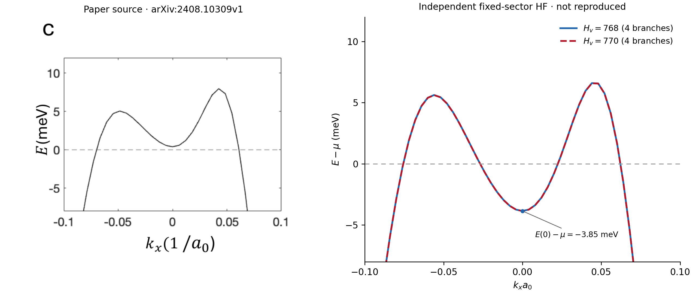

# Vituri 2024 HF band comparison at the panel-c density

## Compared quantities

The left panel is the arXiv-v1 source raster in `SC_fig_4.pdf`, panel c. Its caption specifies

- `Delta1 = 28 meV`;
- `n = -1.03e12 cm^-2`;
- energy relative to the Fermi level along a `k_y=0` cut.

The right panel is an independent fixed-sector HF calculation at the same nominal density and displacement field. It shows the internal valley-`+` cut, whose orientation matches the displayed paper curve. The calculation uses the predeclared N101 regulators `H_v=768` and `H_v=770`; each includes all four pure coordinate paths generated by the two rank-one mirror shells. No paper pixels or digitized values enter the solver.

## Sealed calculation

The sealed outcome for Slurm job `303156` is `mirror_branch_all_stationary`. An external `sacct` receipt, Git-anchored in the provenance JSON but not part of the job sentinel, records `COMPLETED`, node `node043`, elapsed `00:40:20`, and exit code `0:0`.

All eight coordinate paths converged in three iterations and pass the fixed-sector stationarity gates. At each regulator, the four paths start from distinct coordinate choices but collapse to the same final density, Hamiltonian, scalar energy, and band cut. Hence the plotted four-path envelopes have exactly zero width.

## Result

The calculation reproduces the broad asymmetric double-hump shape and a comparable outer momentum scale, but it does **not** reproduce the crossing pattern on the displayed `k_y=0` cut.

- Paper raster: the central minimum is visibly above `E=0`, with only two outer Fermi crossings.
- Independent HF:
  - `H_v=768`: `E(0)-mu = -3.8536573 meV`;
  - `H_v=770`: `E(0)-mu = -3.8575365 meV`.
- The calculated cut therefore has four crossings:
  - `H_v=768`: `[-0.0755785, -0.0268241, 0.0224130, 0.0620849]`;
  - `H_v=770`: `[-0.0755739, -0.0268538, 0.0224279, 0.0620746]` in `k_x a0`.

The center changes by only `0.00388 meV` between the two regulators, and the largest crossing shift is about `2.97e-5` in `k_x a0`. Thus branch selection and the tested `768/770` finite-volume ambiguity do not explain the central-sign or crossing-count discrepancy.

The matched display window intentionally follows the paper panel. Outside it, the deep negative tail differs by about `6.82 meV` between the two regulators, so this is not a full-cut or thermodynamic convergence claim.

## Interpretation boundary

This result establishes a mismatch for the declared valley-balanced, spin-polarized fixed sector. It does not establish an unrestricted global Aufbau solution, local HF stability, the physical ground state, author-exact numerical policy, or TDHF authority. The paper provides no numerical source table for panel c, so its central value and crossing coordinates are not assigned exact digitized numbers here.

Machine-readable metrics and hash provenance are in:

- `reports/data/vituri2024_hf_band_panel_c_matched_density_metrics_20260818.json`;
- `reports/data/vituri2024_hf_band_panel_c_matched_density_provenance_20260818.json`.
