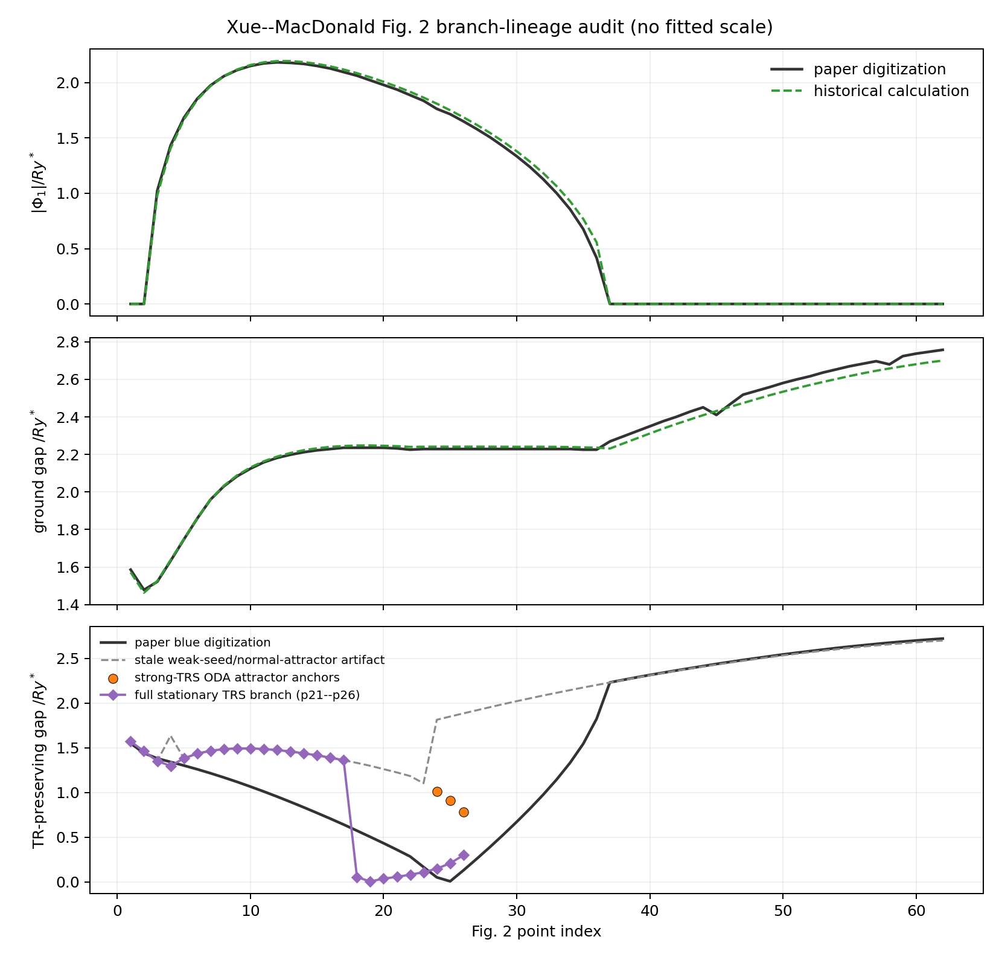
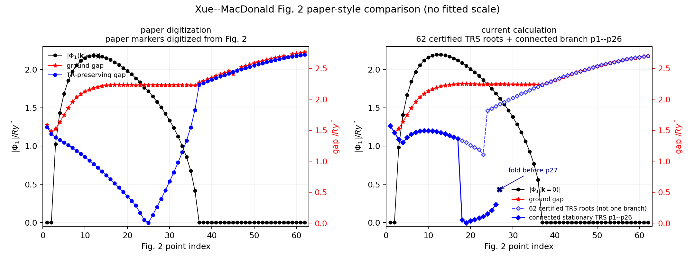
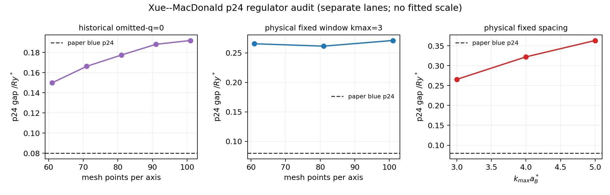

# Xue--MacDonald 2018 Fig. 2 blue-branch reproduction report

> **Dataset ID:** `xue2018-fig2-branch-lineage-audit-v1`
>
> **Branch:** `debug/excitonic-reproduction`
>
> **Status date:** 2026-08-28

## Scope and authority

This report addresses only Xue and MacDonald, *Physical Review Letters* **120**,
186802 (2018), Fig. 2, with emphasis on the bottom-panel blue
**time-reversal-preserving nematic branch**. Paper digitization is comparison
only and is never used as a solver input.

The historical reconstruction lane is

```text
61x61 inclusive nodes on [-3,3]^2
uniform spacing-squared weights
single q=0 Fock point omitted
```

This lane is an inferred historical discretization, not regulator-independent
continuum authority. The physical lane must instead use midpoint cells,
cell-integrated singular terms, and explicit momentum-window checks.

## First correction: the old bottom panel was provenance-inconsistent

The previous report quoted the strong-TRS ODA attractor at points 24--26,

\[
1.01620717,\quad 0.91390618,\quad 0.78088646\;Ry^*,
\]

while the tracked JSON and comparison PNG plotted an older weak-seed branch
that had collapsed to the normal-like attractor,

\[
1.81490508,\quad 1.85099293,\quad 1.88639482\;Ry^*.
\]

Those values must not be spliced into one curve. The old full-path data are now
explicitly labeled `stale_historical_branch_artifact` with branch ID
`xue2018-trs-weak-seed-normal-attractor-fullpath-v1`; the strong branch is
stored only as three separately identified anchors with branch ID
`xue2018-trs-strong-attractor-p24-p26-v1`. The active figure is
generated from one versioned branch-data file and bound by a hash manifest:

- [`data/xue2018_fig2_branch_data.json`](data/xue2018_fig2_branch_data.json)
- [`data/xue2018_fig2_artifact_manifest.json`](data/xue2018_fig2_artifact_manifest.json)



For direct visual comparison with the paper layout, the following figure uses
the same combined order-parameter/gap presentation. The current-calculation
panel shows the historical black/red finite-grid candidate, a complete
62-point inventory of independently certified complete-TRS stationary roots
as an open dashed diamond line, and the connected p1--p26 stationary branch
as solid blue diamonds. Every open-diamond point passes the full residual,
TRS, and number gates, but the inventory is not claimed to be one connected
branch. The solid branch was transported sequentially from p21 through p1 and
from p21 through p26; it is not spliced with the independent inventory.
The 62-point certification has maximum full residual RMS / maximum
`5.68e-10 / 3.41e-9`, zero final TR error, and maximum absolute number
residual `1.71e-14`. Its comparison with the paper blue markers gives MAE
`0.44896 Ry*`, RMSE `0.70773 Ry*`, and maximum error `1.84258 Ry*` at p25.
Bulk job `465032` retained 61 completed point attempts before an engineering
exception at p40; p40 was recovered from the accepted p39 checkpoint in job
`465058`, and the sole near-gate p14 case was recovered from p13 in job
`465084` without rerunning accepted points.



The bottom panel intentionally shows two different calculated lineages rather
than presenting either one as the paper branch.

## Paper contract

The ordinary-electron basis is

\[
(c\uparrow,v\uparrow,c\downarrow,v\downarrow),
\]

and the interaction acts on

\[
D=P-P_{\rm ref},\qquad
P_{\rm ref}=\operatorname{diag}(0,1,0,1).
\]

The paper identifies a higher-energy TR-preserving nematic solution with the
schematic Hamiltonian

\[
H_{\rm TRS}(\mathbf k)=
\xi_{\mathbf k}s_0\tau_z+A k_xs_z\tau_x-A k_ys_0\tau_y+X s_y\tau_y,
\]

for which the gap can close when

\[
\xi_{\mathbf k}=0,\qquad A k_y=X.
\]

Because this path connects normal-insulator and QSHI limits while preserving
time reversal, a continuous branch must pass through a quasiparticle closure.

## What is already excluded

The mismatch is not explained by:

- the sign of the `s_y tau_y` seed;
- weak seed amplitude;
- a simple Hartree factor;
- the single `q=0` prescription alone;
- extra TR-compatible momentum-dependent Pauli channels;
- plotting, broadening, smoothing, or coordinate adjustment.

The saved p24 strong solution has time-reversal error approximately
`1.9e-13 Ry*`. Projecting the interaction to the paper's literal four-term
ansatz still gives a stable p24 gap near `0.9833 Ry*`.

## Why ODA is not decisive for the blue branch

The current ODA/SCF map is an energy-descent solver. It reliably finds
attractive local minima but cannot be used to rule out a higher-energy
stationary branch, separatrix, fold, or saddle.

At p24, ODA finds two attractive roots:

| root | gap / `Ry*` | reference-relative energy / `Ry*/a_B*^2` |
|---|---:|---:|
| normal-like | `1.81490554` | `-0.41183921` |
| strong TR-preserving | `1.01620637` | `-0.38010018` |

The digitized paper blue gap is approximately `0.05279 Ry*`.

A normal-to-strong density chord contains a low-gap state near
`t=0.6596748972`, with saved-grid gap `0.0681161 Ry*` and a diagnostic
off-grid estimate `0.0619796 Ry*`. However its full residual RMS is about
`0.0700`, so it is an initializer, not an HF fixed point.

Within the literal four-term constrained ansatz, Newton--Krylov finds a p24
root with residual RMS `2.9e-15` and gap `0.18836 Ry*`. A direct full-space
restart from that constrained root falls into the normal basin; this reflects
the instability and narrow basin rather than the absence of a continuation.

A self-energy constraint-release homotopy now resolves this ambiguity:

\[
\Sigma=\left[(1-\lambda)\mathcal P_{\rm TRS}
+\lambda\mathcal P_{4}\right]\Sigma_{\rm int}[D(H_0+\Sigma)],
\qquad \lambda:1\to0.
\]

Here `lambda=1` exactly reproduces the four-term constrained equation and
`lambda=0` is the complete-TRS self-energy equation. At both p24 and p25 all
14 continuation weights converged without a fold, with minimum adjacent-state
overlap above `0.99990`. The endpoints are the already identified low-gap full
stationary roots:

| point | constrained gap | released full gap | endpoint overlap with low-gap branch |
|---:|---:|---:|---:|
| 24 | `0.18836` | `0.14986` | `0.9999999999999998` |
| 25 | `0.25635` | `0.20985` | `0.9999999999999991` |

A second, higher-gap constrained p25 root from forward constrained
continuation was also released. Its gap evolves from `0.86651 Ry*` to
`0.913905 Ry*`, and its endpoint overlaps the refined strong-TRS root by
`0.9999999999999998`. Therefore the two known constrained p25 root classes
map respectively to the low-gap stationary branch and the strong-TRS branch.
Neither hides a separate paper-like branch.

## Full stationary branch now found

Using the low-gap chord only as an initializer, followed by

```text
complete-TRS residual projection
T/Ry* = 1e-2 -> 3e-3 -> 1e-3 -> 3e-4 -> 1e-4 -> 0
Newton--Krylov root refinement
pseudo-arclength continuation
full unprojected residual checks
```

we found a genuine unrestricted stationary branch with branch ID
`xue2018-trs-full-stationary-p1-p26-v2`.

The branch has now been continued backward from p21 through every exact path
point p20--p1 using 83 accepted adaptive parameter steps at `T=0`. All 26
integer-point roots pass the full gates; the maximum residual RMS/maximum are
`9.23e-11 / 2.13e-9`, final TR error is zero, and the minimum adjacent
integer-point density overlap is `0.91384`. The p1--p26 comparison with the
paper blue markers has MAE `0.32292 Ry*` and RMSE `0.39190 Ry*`. The table below
highlights the near-closure p21--p26 segment.

| Fig. 2 point | paper blue / `Ry*` | stationary grid gap / `Ry*` | local-cell off-grid diagnostic / `Ry*` |
|---:|---:|---:|---:|
| 21 | `0.36149` | `0.05747` | `0.04468` |
| 22 | `0.28576` | `0.08341` | `0.07084` |
| 23 | `0.16825` | `0.10957` | `0.10679` |
| 24 | `0.05279` | `0.14986` | `0.14980` |
| 25 | `0.00842` | `0.20985` | `0.20899` |
| 26 | `0.13157` | `0.30075` | `0.29637` |

Every listed zero-temperature point has full residual RMS below `3e-11`, full
residual maximum below `4e-10`, and TR error below `4e-12`. The p24 root is
unstable under simple fixed-point iteration in both sectors:

- complete-TRS Jacobian spectral radius: `1.95042`;
- TR-breaking-complement spectral radius: `2.30457`.

These are fixed-point-map eigenvalues, not an energy-Hessian certificate.
The off-grid column omits the source node associated with the bounded local
mesh cell throughout minimization. It is a continuous local extension of the
historical omitted-`q=0` rule, but it is non-unique and not continuum
regulator authority. It confirms that mesh-node minimization is not the source
of the p24--p26 disagreement.

The finite-temperature horizontal pseudo-arclength branch folds at
`A = 0.24844 Ry* a_B*`, before reaching Fig. 2 point 27.

## Physical midpoint/integrated-cell p24 checkpoint

A separate physical-regulator calculation has now produced one accepted p24
zero-temperature stationary root on a `61x61` midpoint mesh over
`[-3,3]^2`, with the Coulomb singular source cell integrated at quadrature
order 96. The initial job reached a valid `T/Ry*=1e-2` checkpoint and then
stopped on a SciPy Anderson forcing-term overflow. Recovery resumed from that
exact checkpoint after adding a fail-closed Newton--Krylov fallback; the
completed temperatures were not rerun.

The final `T=0` result is:

- saved-grid gap: `0.2942310998 Ry*`;
- full residual RMS / maximum: `1.93e-13 / 5.04e-12`;
- TR error: `0`;
- number residual: `-3.33e-15`;
- reference-relative energy density: `-0.4045605972 Ry*/a_B*^2`;
- state SHA-256: `b7dae8497bb015fe541401e2914f8ff08e25ad781dfabf7bd908e37a94cecf9f`.

The arbitrary-k evaluator reproduces the saved-node Hamiltonian to
`8.90e-16` and satisfies strong-TRS covariance at an off-grid pair to
`7.63e-13`. A deterministic `5x5` multistart search inside the saved-grid
minimum cell gives a lower local-cell gap of `0.2654547023 Ry*`; quadrature
orders 48, 96, and 160 agree to below `1e-15`. This is a local-cell candidate,
not yet a global continuum-gap certificate.

A packed four-case convergence campaign then transported the same branch to
additional midpoint/integrated-cell regulators. Every T=0 root passed the
full residual, TR, and number gates; the minimum transported-seed overlap was
`0.97571`. The resulting fixed-window mesh ladder is:

| `kmax a_B*` | mesh | grid gap / `Ry*` | local-cell gap / `Ry*` |
|---:|---:|---:|---:|
| 3 | `41x41` | `0.3569980` | `0.2958275`* |
| 3 | `61x61` | `0.2942311` | `0.2654547` |
| 3 | `81x81` | `0.2795459` | `0.2613908` |
| 3 | `101x101` | `0.2842412` | `0.2709999` |

The starred coarse-mesh local optimizer returned an abnormal status and is
not used as an acceptance point. The accepted local-cell candidate changes
from `0.26545` to `0.26139` and then back to `0.27100 Ry*` on the
`61 -> 81 -> 101` ladder. Fixed-window mesh convergence is therefore
nonmonotonic and remains unestablished.

More decisively, an approximately fixed-spacing window ladder gives:

| `kmax a_B*` | mesh | cell width / `a_B*^-1` | local-cell gap / `Ry*` |
|---:|---:|---:|---:|
| 3 | `61x61` | `0.09836` | `0.2654547` |
| 4 | `81x81` | `0.09877` | `0.3221144` |
| 5 | `101x101` | `0.09901` | `0.3633038` |

The local-cell gap increases by `0.09785 Ry*` from `kmax=3` to `5`, so the
physical branch is strongly UV/window dependent under the public continuum
model.

This drift can now be traced to the paper equations. Main-text Eq. (6) defines
the density relative to a fully filled valence band, while Supplemental
Eq. (14) has, for equal masses,
`xi_k=(k^2+Eg)/2`, `Delta_k -> A k`, and
`n_c=(1/2S) sum_k (1-xi_k/E_k)`. Therefore the two-spin high-k conduction
occupation is `2 A^2/k^2+O(k^-4)`, giving

```text
n_c(Lambda) = constant + (A^2/pi) log Lambda + ... .
```

Between `kmax=3` and `5`, the calculated bare-H0 conduction-density increase
is `0.008266 a_B*^-2`, versus the analytic logarithmic prediction
`0.007870 a_B*^-2`. The resulting Hartree band-splitting change is
`0.05355 Ry*`, more than half of the observed `0.09785 Ry*` local-gap drift;
Fock/self-consistent changes supply the remaining comparable scale. Thus the
UV sensitivity is already present in the paper's bare BHZ hybridization sea,
not generated by the stationary solver or singular-cell quadrature.

A source-archive forensic also found that the author-produced supplemental
`vortexfigs.pdf` labels all momentum panels by `[-3,3]^2`. Its four lossless
embedded rasters each contain exactly 100 detected grid lines per axis. This
directly constrains the supplemental two-band visualization, but does not
uniquely prove the main four-band Fig. 2 node count. We therefore ran a blind,
source-motivated n≈100 follow-up rather than treating the raster as an input
fit.

Sequential continuation of the historical omitted-`q=0` low branch gives:

| mesh | p24 grid gap / `Ry*` | `|Phi_TRS(Gamma)| / Ry*` |
|---:|---:|---:|
| `61x61` | `0.1498597` | `1.49031` |
| `71x71` | `0.1662565` | `1.49999` |
| `81x81` | `0.1774506` | `1.50630` |
| `91x91` | `0.1881094` | `1.51059` |
| `101x101` | `0.1919204` | `1.51382` |

All these roots pass the full stationary gates and adjacent transported
overlaps exceed `0.9993`. The n101 historical gap is still `0.13913 Ry*`
above the paper blue p24 value `0.05279 Ry*`. A one-step n61->n101 restart
instead fell into a strong-like `1.03701 Ry*` root, confirming that direct
restart is not branch-identity evidence.

Consequently, neither the source-motivated n≈100 historical resolution nor
the physical n101 refinement restores the paper blue closure. This physical
checkpoint must remain separate from the historical omitted-`q=0` p1--p26
curve. It is **not continuum authority**, and it is not evidence that the
paper blue point has been reproduced.



## Current conclusion

The stationary-root hypothesis was partly correct: ODA missed a real
higher-energy full-TRS stationary branch. However, the branch found from the
low-gap initializer is **not the paper blue curve**. It is now certified from
p1 through p26, but its near-closure p21--p26 gap trend is opposite to the paper
trend, and it folds before point 27 instead of connecting
the displayed NI-like and QSHI-like sides.

A deterministic p25 inventory from eight independent complete-TRS starts
found only three already known root classes: one normal-like root, five
strong-TRS convergences, and two low-gap stationary-branch convergences. A
full density-chord scan likewise has only the endpoint sign changes and one
interior initializer interval. This is not an exhaustive nonexistence proof,
but no additional paper-like near-zero p25 root was found. The exact four-term constrained roots have also been excluded as a separate
candidate: the low constrained root class releases into the low-gap stationary
branch, while the higher constrained root class releases into the strong-TRS
branch.

A follow-up branch-switching search used the leading complete-TRS fixed-map
modes of the p25 low branch (`1.79209` twice, `1.41399`, and a near-unit mode).
Six signed eigenmode starts were solved with the three known p25 roots
deflated. The only accepted solution was a symmetry-rotated representative of
the known strong-TRS root: gap `0.913905 Ry*` and Γ nematic amplitude
`2.029267 Ry*`. The other five candidates remained nonstationary; the best
full residual RMS was `2.29e-3`, and ordinary Newton--Krylov refinement of the
four leading stalled candidates also failed (`2.13e-3` to `2.51e-3`).

At p27 (`A=0.25 Ry* a_B*`), four starts from the normal endpoint, strong
endpoint, and the two sheets adjacent to the verified fold were tested at
`T/Ry*=1e-3`. Only the normal root converged, with gap `1.92131 Ry*`. The
strong and two fold-sheet candidates stalled with full residual RMS from
`3.29e-4` to `4.68e-4`; their apparent gaps near `0.53 Ry*` are therefore not
stationary results and are not promoted.

This follow-up is stronger basin evidence but still not an exhaustive
nonexistence proof. No additional paper-like stationary root was accepted.

Therefore the remaining problem is no longer merely “implement a root
solver.” We must determine whether a disconnected branch exists outside the
current multistart/chord basins, or whether the paper used an unpublished
constrained/legacy closure.

## Remaining solver work

Implemented and validated:

1. full residual
   \[
   R[D;p]=D-\left[P_{\beta,\mu}(H_0(p)+\Sigma_H[D]+\Sigma_F[D])-P_{\rm ref}\right];
   \]
2. exact full-TRS projector with integer `k <-> -k` pairing;
3. Anderson/Newton--Krylov stationary solving without physical-energy descent;
4. finite-temperature homotopy to the zero-temperature rank-two map;
5. pseudo-arclength continuation through a verified fold;
6. full residual, TR, number, overlap, energy, and local fixed-map stability diagnostics;
7. exact four-term-to-full self-energy constraint release at p24 and p25.

Still required:

1. extend branch enumeration beyond the completed p25 eigenmode/deflation and
   p27 endpoint/fold-sheet searches, especially with additional deterministic
   complete-TRS seeds and symmetry-orbit-aware deflation;
2. determine whether a controlled UV/reference closure can remove the
   demonstrated physical-window drift without fitting the paper, and broaden
   the off-grid search beyond the current saved-grid minimum cell;
3. continue the physical stationary branch only after that regulator gate;
4. an energy-Hessian or equivalent thermodynamic stability classification;
5. author code/data or an explicit historical constrained-solver prescription.

A historical omitted-`q=0` node rule has no unique continuous arbitrary-k
extension. Its mesh-node gaps must remain labeled historical; continuous gap
minimization must use a separately defined cell-integrated regulator.

## Promotion gate

The blue branch may be reported as solved only after at least seven adjacent
points belong to one pseudo-arclength branch and each satisfies:

```text
residual RMS < 1e-9
residual max < 1e-8
TR error < 1e-10
explicit half-filling/number closure
saved full density and immutable solver manifest
controlled finite-T -> zero-T continuation
branch continuity without silent solver or regulator changes
```

At least one point must have a converged direct gap near zero in the
cell-integrated lane, and the branch must connect NI-like and QSHI-like sides.
